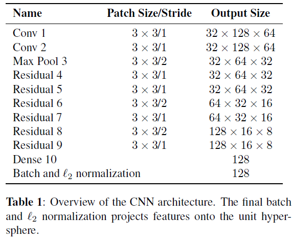
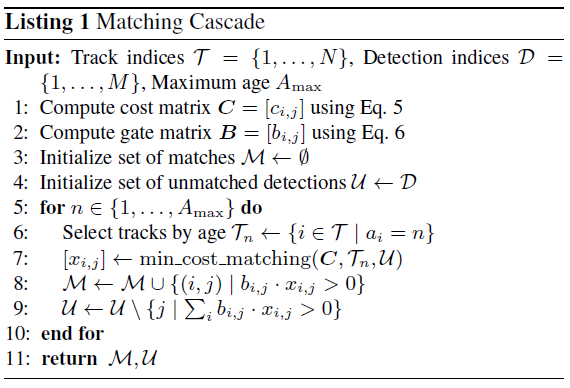

<!-- more -->

## Sort和DeepSort论文阅读笔记

### 概述

#### 1.一些术语

**Trajectory**(轨迹)：一条轨迹对应这一目标在一个时间段内的位置序列

**Tracklet**(轨迹段)：形成Trajectory过程中的轨迹片段。完整的Trajectory是由属于同一目标的Tracklets组成。

**ID switch**(ID切换)：对于同一个目标，由于跟踪算法误判导致其ID发生切换的次数，理想的跟踪算法ID switch应为0。

#### 2.评价指标

最主要的评价指标是`MOTA` ,该指标包含了三个要素：FP、FN、identity switches(ID switch)。MOTA越高代表跟踪的综合性能越好。

#### 3.框架策略

- Tracking - by - detection(TBD)

- Detection-Free Tracking(DFT)

MOT问题本质上可以视为数据关联的问题，即如何将不同时刻的检测目标关联起来，关联目标主要以目标`motion`的建模和`apperance`即目标的外观作为关联的根据。

### Sort

在卡尔曼滤波的基础上+匈牙利算法将**卡尔曼滤波预测的BBox**与**物体检测的BBox**进行了匹配，选择合适的物体检测BBox作为下一时刻的**物体跟踪BBox**。

#### 1.Detection

采用了FasterRCNN，

#### 2. Estimation Model

通过`linear constant velocity model`（线性恒速度模型）估计帧间物体的位移。
$$
x = [u,v,s,r,\dot{u},\dot{v},\dot{s}]^{T}
$$
每一个目标的状态采用上述模型描述，其中`u`和`v`分别表示目标中心水平和垂直方向像素位置；`s`和`r`分别表示面积(scale)和目标边界框的长宽比(aspect ratio)。当一个检测与目标相关联之后，检测得到的bbox被用于更新目标的状态（被更新的状态中，速度分量由卡尔曼滤波器估计得到）；若没有检测与目标关联，利用线性恒速度模型对其状态进行简单预测无需纠正。

#### 3.Data Association

在分配检测结果到现有的跟踪目标过程中，每一个跟踪目标的bbox通过卡尔曼滤波器提前预测。然后计算每个检测目标和预测的跟踪目标的bbox的交并比(IOU)作为代价矩阵。最后通过`匈牙利算法(Hungarian algorithm)`解决最优分配问题，小于阈值$IOU_{min}$的目标不会分配此检测器。

#### 4.Creation and Deletion of Track Identities

当目标进入或者离开图像，相应需要创建和销毁跟踪的ID。

对于创建一个跟踪目标，根据是检测与目标的重叠(IOU)小于一定阈值 $IOU_{min}$ ，即认为此检测是一个未被跟踪的对象，并将其状态进行初始化(形状为检测的bbox形状，速度为0),由于此点速度无法估计，因此速度分量的协方差应初始化为一个较大的值，以表征此不确定性。同时，新加入的目标应经过一段试用期，目标需要与检测相关联，以积累足够的证据，防止`false positive`。

跟踪终止，当在$T_{Lost}$帧没有检测到与之关联的检测。这可以防止跟踪器数量的无限增长和由于<u>长时间不根据检测修正的预测</u>导致的定位误差。一般$T_{Lost}$被设置为1，因为`恒速度模型`不能很好的描述目标的动态特性，其次本工作关注于帧与帧之间的跟踪，`目标的重识别`超出了本工作的内容。另外，尽早地删除丢失的目标有利于提高效率。

----

### Deep Sort

由于Sort对于物体遮挡没有显式地处理，因此其`ID Switch`很高,因此DeepSort中融入了apperance information,即结合了运动和外观的信息。

#### 1. Deep Association Metric

- **state space:** $(u,v)$ 为bbox中心位置，$r$为纵横比，$h$为高度，以及它们在图像坐标系下的相对速度

$$
(u,v,\gamma,h,\dot{x},\dot{y},\dot{\gamma},\dot{h})
$$

依然采取恒速度的线性观测模型进行估计，直接估计的状态为$(u,v,r,h)$，

- **assignment problem**:

  Sort 中将新检测到的物体与状态估计得到的预测框进行匹配采用的是`匈牙利算法`。在DeepSort中需要综合运动和外观信息进行匹配,对此设计了两个合适的度量。

  *1.motion information:* Mahalanobis distance
  $$
  d^{(1)}(i,j)=(d_j-y_i)^{T}S_i^{-1}(d_j-y_i)
  $$
  其中$d_j$为第$j$个检测到的bbox，$y_i$为第$i$个估计的bbox，马氏距离,指标为,本文阈值为$t^{(1)} = 9.4877$
  $$
  b_{i,j}^{(1)}=1[d^{(1)}(i,j)\leq t^{(1)}]
  $$
  *2.apperance information:* cosine distance
  $$
  d^{(2)}(i,j)=min\{1-r_j{}^{T}r_k^{(i)}|r_k^{(i)}\in R_i\}
  $$
  对于每个新检测到的bbox $d_j$，我们计算外观描述（apperance descrioptor）$r_j$,$||r_j||=1$。同时，创建$R_k=\{r_k^{(i)}\}_{k=1}^{L_k}$为最近$L_k=100$次成功跟踪后 物体检测bbox对应的$L_k$个特征向量集合。然后第二种度量方式通过第$i$个跟踪物体特征向量与第$j$个检测特征向量之间的最小余弦距离表示。

  同样引入一个二元变量表示此关联是否被允许：
  $$
  b_{i,j}^{(2)}=1[d^{(2)}(i,j)\leq t^{(2)}]
  $$
  外观描述特征向量如何获取？文章中采用了CNN网络获取，结构如下：
  
  
  
  综上，通过加权获得最终的度量标准:$c_{i,j}=\lambda d^{(1)}(i,j)+(1-\lambda)d^{(2)}(i,j)$，同时对应的关联标准$b_{i,j}=\prod_{m=1}^{2}b_{i,j}^{(m)}$,当相机有较大运动时，取$\lambda=0$是合适的选择。但基于卡尔曼滤波器推断的马氏距离仍用于忽视不可行的分配。

- **Matching Cascade**

  解决了度量问题后，如何匹配track 和 detect，文中提出如下方式：

  

  输入为跟踪集合和检测集合，索引分别为$T,D$ ;首先根据之前的公式计算了代价矩阵**C**和门控矩阵**B**。然后对跟踪器最长存在时间进行迭代，在第6行中选择跟踪器子集$T_n$(过去n帧都没有被检测器匹配的跟踪目标)，第7行根据代价矩阵匹配$T_n$和为别分配的检测器目标。第8，9行更新匹配和未匹配的集合，最终返回$M,U$ 。

  显然此循环保证了优先将检测的新目标分配给最近的跟踪。最终匹配阶段，通过和Sort中一样的IOU关联算法作用于age=1的未被匹配跟踪目标，这有助于解释外观的突然变化（例如由于被静态场景局部遮挡）。

  

- **Deep Apperance Descriptor**

  通过在行人重识别数据集上的训练CNN。

