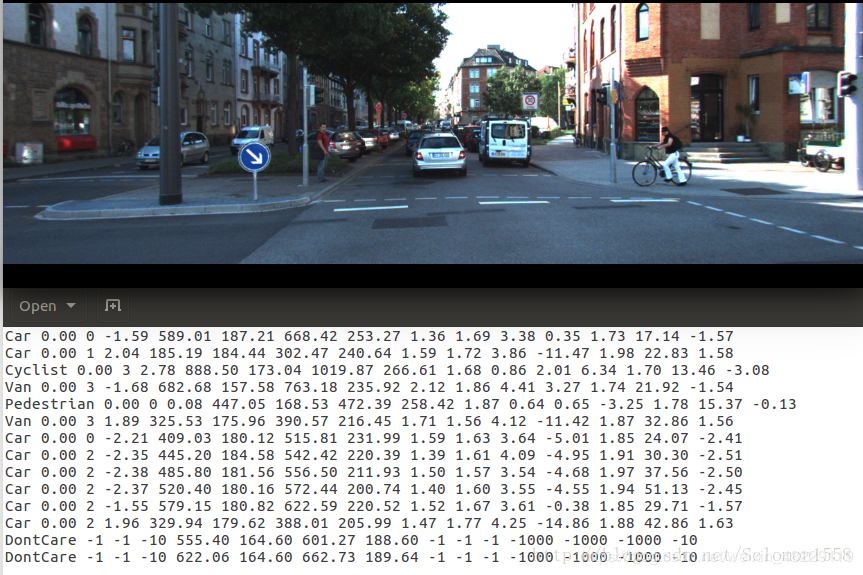

---

title: Apollo 中的detector
categories:
- apollo
tags:
- perception
- detector
mathjax: true
---

<!--more-->

##　KITTI数据集结构

kitti数据集采集方式参考http://www.cvlibs.net/datasets/kitti/setup.php


数据集的标签形式：


label描述:

> ```
> #Values    Name      Description
> ----------------------------------------------------------------------------
>    1    type         Describes the type of object: 'Car', 'Van', 'Truck',
>                      'Pedestrian', 'Person_sitting', 'Cyclist', 'Tram',
>                      'Misc' or 'DontCare'
>    1    truncated    Float from 0 (non-truncated) to 1 (truncated), where
>                      truncated refers to the object leaving image boundaries
>    1    occluded     Integer (0,1,2,3) indicating occlusion state:
>                      0 = fully visible, 1 = partly occluded
>                      2 = largely occluded, 3 = unknown
>    1    alpha        Observation angle of object, ranging [-pi..pi]
>    4    bbox         2D bounding box of object in the image (0-based index):
>                      contains left, top, right, bottom pixel coordinates
>    3    dimensions   3D object dimensions: height, width, length (in meters)
>    3    location     3D object location x,y,z in camera coordinates (in meters)
>    1    rotation_y   Rotation ry around Y-axis in camera coordinates [-pi..pi]
>    1    score        Only for results: Float, indicating confidence in
>                      detection, needed for p/r curves, higher is better.
> ```

## 多任务YOLO -3D

- **3D bounding box描述**

  

  ​	对任意相机坐标系下的障碍物3D bbox有9个自由度，因此可以由9个参数表示（中心点$T={\{X,Y,Z}\}$,长宽高$D=\{L,W,H\}$,以及各坐标轴旋转角$R=\{\phi,\varphi,\theta\}$）,等价与3D框的8点描述(需要24个参数)。

  ​	由3D bbox通过相机内参投影即可获得2D bbox　但是反之直接由2D bbox得到完整3D bbox是不可行的。

  ​	首先通过一些假设简化需要获取的3D框参数数量：

  ​	１）地面平行假设：

  ​			- 通过假设地面平行，则3D障碍物只沿垂直地面的坐标轴旋转，另两个方向并未旋转，即只有yaw偏移角度，			  令roll和pitch的旋转角均为0

  ​			- 此时，障碍物中心高度与相机高度相当，可简化认为障碍物Z=0

  

  ​	通过成熟的2D障碍物检测算法，可以较准确的得到图像上2D边界框的像素位置($h,w,c_x,c_y$)

  ​	对3D障碍物的6维描述中，可以选择神经网络来预测方差较小的参数，例如障碍物的真实物理大小(同类别的障碍物的物理大小不会出现量级上的偏差)，同时yaw旋转角度也能较容易的预测。

  ​	目前，无法通过训练直接得到的参数是障碍物中心相对相机坐标系的偏移量X和Y,若得到X和Y，即通过$\sqrt{X^2+Y^2}$计算得到在同一水平面上障碍物离相机的真实距离，也就是实现了单目测距。

  

  实现单目相机3D障碍物检测所需的步骤总结如下：

  (1) 训练网络，预测大部分参数：

  - 图像中障碍物2D bbox检测
  - 障碍物物理（真实）尺寸（依据同类别物体的方差较小）
  - 相对偏转角yaw(不因障碍物在图像中位置所影响)

  (2) 通过图像几何学方法，计算障碍物中心点相对相机坐标系的偏移量X分量和Y分量( $T={X,Y,0}$)

  

- **实现多任务的输出**：

  ​	目标检测的2D bbox(单位为像素),3D真实物体尺寸(长宽高，单位为米)，障碍物的类别以及障碍物的相对偏转角(alpha与kitti数据集定义相同)

  ​	模型训练需要注意：
  ​	(1) 确保数据集标注质量，尤其是3D障碍物框。可借助激光雷达辅助标注

  ​	(2) 定义合适的损失函数，可以参考[3D Bounding Box Estimation Using Deep Learning and Geometry][https://arxiv.org/abs/1612.00496]

  ​	(3) 相关数据增强，避免过拟合，左右对称翻转有意义，上下翻转无意义。

  ​	(4) anchor和yolo相同，是通过聚类获得的。

  ​	

  在训练完成获得上述参数之后，接下来需要考虑如何计算出障碍物里相机的距离，通过内参矩阵和几何学关系，联系图像中3D障碍物大小（像素）和真实3D坐标系下障碍物大小(单位为米)之间的关系。

  

  通过单视图衡量([single view metrology][http://ieeexplore-ieee-org-s.ivpn.hit.edu.cn:1080/document/791253])来解释此几何关系：任一物体，已知其实际的长宽高、朝向和距离，则它在图像中的具体形状大小唯一确定，反之亦然。（此处，我们通过物体图像尺寸、实际物理尺寸和朝向角推断物体距离）

  对于每种障碍物，根据其平均尺寸，建立查询表，覆盖360度yaw角度变化，来映射不同的距离，查询表可以定义单位标尺(例如在图像某个2d位置上，高一米的障碍物在图像上有多高）通过单位标尺对应的像素数目，快速查到车的真实高度。
  
  综上，Apollo中单目相机下的障碍物检测流程为如下图所示，检测速度可达30hz以上。
  

输入单幅图像－》通过网络预测大部分参数－》基于单视图度量方法，预测剩余参数(距离和中心点坐标)
其中,在车辆颠簸的情况下，相机内参基本不会发生变化，而外参可以借助在线标定(online calibration)得到实时的外参，提高单目测距的准确性。可以通过车道线来校准，两条平行线无穷远处相交，通过车道线信息，可以帮助我们在线调整传感器标定。

提高单目测距准确性的方法：
(1)借助跟踪算法的上下帧之间的关联性，修正物体朝向和速度
(2)激光雷达和毫米波雷达能够提供准确的测距信息，进行传感器融合。
(3)若物体有遮挡，则要求神经网络能够预测遮挡程度的百分比，并根据遮挡情况给出更准确的距离判断。
(4)最终和其他传感器的融合进行测距是必不可少的，当地面坡度不平时，单目相机检测结果在进行传感器融合时，参考应	该降低，融合时是做graph-graph之间的匹配，不需要过度担心相机的准确率。

## Apollo中的YOLO3D


## CUDA编程

核函数使用方法：
```cpp
Function<<<griddim,blockdim,extern shared memory,GPU stream>>>(param...);
```

其中中间参数可以控制核函数运行所占用的资源：
`griddim`为调用的block数，`blockdim`为调用的thread数，后面两个参数分别表示动态定义共享内存大小和可使用的SM处理器数。


kernel函数的定义采用`__global__`修饰符修饰。

```cpp
resize_linear_kernel << < grid, block >> >
      (src.gpu_data(), dst->mutable_gpu_data(),
          origin_channel, origin_height, origin_width,
          stepwidth, height, width, fx, fy);
```


## TensorRT

官方开发手册：https://docs.nvidia.com/deeplearning/sdk/tensorrt-developer-guide/index.html#c_topics

参考博客:https://www.cnblogs.com/vh-pg/p/11680658.html

模型从导入TensorRT到执行`inference`大致经过一下三个阶段:

- Network Definition
- Builder
- Engine

使用过程中首先通过`TensorRT`的全局方法`creatInferBuilder()`创建一个`IBuilder`类指针，然后由该指针调用`IBuilder`类创建`Network`和`Engine`类的指针。
`INetworkDefinition`类
`INetworkDefinition`类即为网络定义，可通过`IBuilder`类方法`creatNetwork()`返回其指针。
`ICudaEngine`
`ICudaEngine`类即为Engine，可通过`IBuilder`类方法`buildCudaEngine()`/`buildEngineWithConfig()`返回其指针。
Engine的运行需要一个运行时的环境，通过`createExecutionContext()`方法为对应的`ICudaEngine`生成一个                     `IExecutionContext`类型的运行环境context。


## 参考文献

> 1.single view metrology[http://ieeexplore-ieee-org-s.ivpn.hit.edu.cn:1080/document/791253]
> 2.http://www.cvlibs.net/datasets/kitti/setup.php
> 3.https://cloud.tencent.com/developer/article/1418687
>
> 

