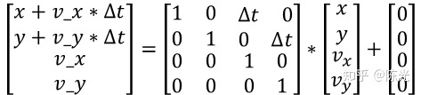

---

title: Apollo中的kalman filter实现
categories:
- autonomous
- apollo
tags:
- apollo
- kalman filter
mathjax: true
---

Apollo中的KalmanFilter实践

<!--more-->

此部分更详细的解释可参考：https://zhuanlan.zhihu.com/p/45238681,此处仅为整理

## KalmanFilter基本形式


### 代码实现：

`modules/perception/cammera/lib/obstacle/tracker/commom/kalman_filter.cc`

- **初始化：不同的运动模型，其状态量不同**

  ```c++
  void KalmanFilterConstVelocity::Init(Eigen::VectorXd x) {
    state_ << x(0), x(1), 0, 0;
    inited_ = true;
  }
  ```

- **预测:使用历史信息对未来位置进行推测**
  $$
  x'=Fx+u\\
  P'=FPF^T+Q
  $$
  其中`F`为**状态转移矩阵(state transistion matrix)**,`u`为外部影响(比如加速度);`P`表示系统的不确定程度**状态协方差矩阵(state covariance matrix)**，初始值很大，随越来越多数据加入到滤波器中，不确定度会变小;`Q`表示**过程噪声（process covariance matrix）**，既无法用`x'=Fx+u`表示的噪声，比如车辆突然上坡。

  恒速度模型的状态转移方程可以表示为:

  

  代码实现：

  ```c++
  void KalmanFilterConstVelocity::Predict(float delta_t) {
    if (inited_) {
      state_transition_matrix_(0, 2) = delta_t;
      state_transition_matrix_(1, 3) = delta_t;
      state_ = state_transition_matrix_ * state_;
      predict_state_ = state_;
      variance_ = state_transition_matrix_ * variance_ *
                      state_transition_matrix_.transpose() +
                  process_noise_;
    }
  }
  ```

- **校正，根据观测值对预测值进行校正：**
  $$
  y=z-Hx'
  $$
  上式计算观测值`z`与预测值`x`的`残差y`。
  其中`H`为**测量矩阵**，表示状态量和测量值之间的对应关系；`z`为实际观测值
  $$
  S=HP'H^T+R\\
  K=P'H^TS^{-1}
  $$
  上式计算得到了**卡尔曼增益K(Kalman Gain)**
  其中`R`为**测量噪声矩阵**,表示的是测量值与真值的差异程度
  $$
  x=x'+Ky\\
  P=(1-KH)P'
  $$
  上述两个公式完成了卡尔曼滤波器的闭环，第一个公式完成了状态向量`x`的更新(综合考虑了预测值和观测值及系统噪声)；第二个公式由卡尔曼增益更新系统的不确定程度`P`

  ```c++
  
  
  void KalmanFilterConstVelocity::Correct(const Eigen::VectorXd &z) {
    if (inited_) {
      Eigen::Vector2d measure;
      measure << z[0], z[1];
      // measurement covariance: S = H*P*H^T + R
      Eigen::Matrix2d cov =
          measure_matrix_ * variance_ * measure_matrix_.transpose() +
          measure_noise_;
  
      kalman_gain_ = variance_ * measure_matrix_.transpose() * cov.inverse();
      variance_ = variance_ - kalman_gain_ * measure_matrix_ * variance_;//不确定度更新
      state_ = state_ + kalman_gain_ * (measure - measure_matrix_ * state_);//状态更新
  
      // compute likelihood
      auto residual = measure - predict_state_.head(2);//获取predict_state_的前两个元素
      likelihood_ =
          std::exp(-0.5 * residual.transpose() * cov.inverse() * residual) /
          std::sqrt(2 * M_PI * cov.determinant());
    } else {
      Init(z);
    }
  }
  ```

  注意到该函数最后计算了一个**似然**,`likelihood_`: 高斯分布
  $$
  likelihood=\frac{1}{\sqrt{2\pi|S|}}e^{-\frac{1}{2}r^TS^{-1}r}
  $$
  其中`r`为观测值与预测值之间的差值（残差residual）


## 扩展卡尔曼滤波(Extend Kalman Filter)

实际车辆的运动并不能完全由恒定速度模型描述，补充非线性系统中使用的扩展卡尔曼滤波，
常见的其他运动模型有：

- 一次运动模型（线性运动模型）
  - 恒定速度(Constant Velocity,CV)模型
  - 恒定加速度(Constant Acceleration,CA)模型
- 二次运动模型
  - 恒定转率和速度(Constant Turn Rate and Velocity,CTRV)模型
  - 恒定转率和加速度模型(Constant Turn Rate and Acceleration,CTRA)模型

以毫米波雷达的感知为例:


毫米波雷达基于多普勒效应检测，其检测的原始数据基于极坐标系，上图中包含了

> 1. $\rho$ :毫米波雷达到障碍物的距离
> 2. $\varphi$ :方向角
> 3. $\dot{\rho}$ :距离的变化率，径向速度

与卡尔曼滤波器相似的步骤：

**1.初始化状态初值**

```c++
void ExtendedKalmanFilter::Init(Eigen::VectorXd x) {
  Init();
  state_ << x(0), x(1), 0, x(2);
  inited_ = true;
}
```

**2.预测**
$$
x'=Fx+u\\
P'=FPF^T+Q
$$


由于毫米波雷达测量障碍物径向位置和速度相对准确,不确定度较低，设置状态协方差阵:


由于过程噪声Q对整个系统存在影响，但不确定影响程度，设置为单位阵或空值即可

**3.观测**
$$
y=z-Hx'
$$
计算观测值$z=[\rho,\varphi,\dot{\rho}]$和预测值$x'=[p_x,p_y,v_x,v_y]^T$之间的残差，由上面毫米波雷达的数据特性,其观测数据的维度是三维的并基于极坐标系，因此需要进行坐标转换,注意下式直接用转换后的坐标代替$Hx'$，并没有实际求$H$


注意到这个转化过程是**非线性**的，因此习惯上将上述模型表示为:
$$
y=z-h(x')
$$
其中$h(x')$即为向量:


此时再看剩下的两个公式：
$$
S=HP'H^T+R\\
K=P'H^TS^{-1}
$$
在求解卡尔曼增益的过程中需要用到测量矩阵$H$,所以还是要求解$H$


上式可以更明显的看出，等式两边的转换是非线性的，即$H$不再是常数。

**如果将高斯分布输入到一个非线性函数中，得到的结果将不再符合高斯分布，及卡尔曼滤波不再适用**，因此需要将上面的非线性函数进行**近似线性化**，比较容易想到的方法就是一阶泰勒展开。

非线性函数$y=h(x)$通过Taylor公式在$(x_0,y_0)$处展开为：
$$
h(x)=h(x_0)+\frac{\dot{h}(x_0)}{1!}(x-x_0)+\frac{\ddot{h}(x_0)}{2!}(x-x_0)^2+\dots
$$
忽略二阶以上的高阶项，得到近似线性化方程：
$$
h(x)\approx h(x_0)+\dot{h}(x_0)(x-x_0)
$$
扩展到多维向量：
$$
h(x)\approx h(x_0)+\frac{\partial{h(x_0)}}{\partial{x}}(x-x_0)
$$
上述偏导可以通过**雅克比(Jacobian)矩阵**表示。


求得非线性函数$h(x')$对$p_x,p_y,v_x,v_y$的一阶偏导数，排列成矩阵，最终得到雅克比阵H


代入$\rho,\varphi,\dot{\rho}$的函数，求偏导，即可得最终的结果：


最后在进行更新状态，即完成扩展卡尔曼滤波器的过程，整个过程与一般的卡尔曼滤波器相同，只不过多了非线性关系通过一阶泰勒展开局部线性化的过程

> 本文中公式的图片来自于知乎专栏https://zhuanlan.zhihu.com/p/45238681
>
> 侵删