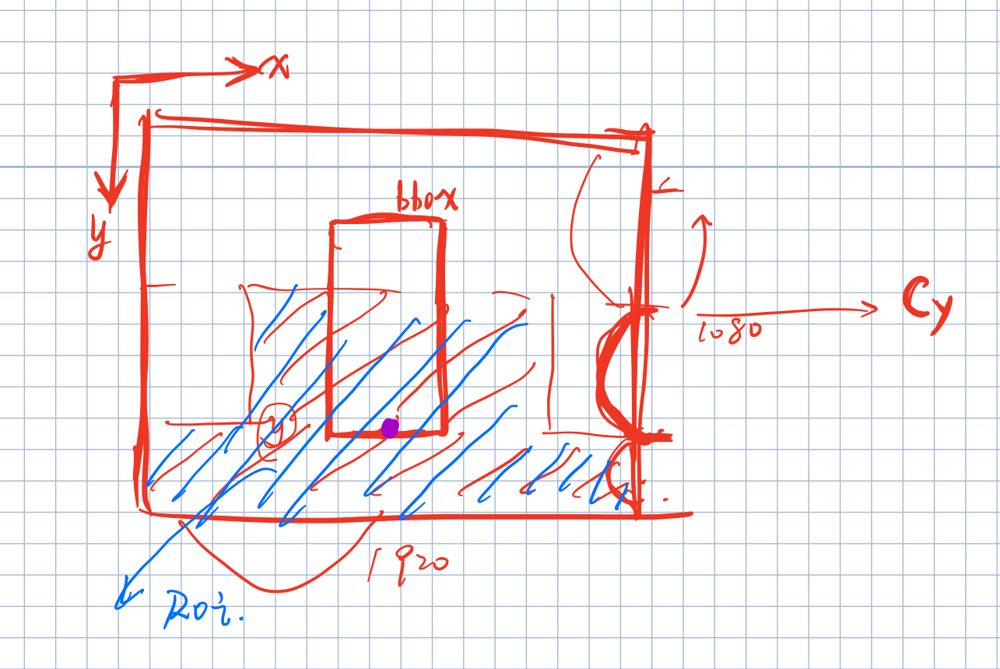
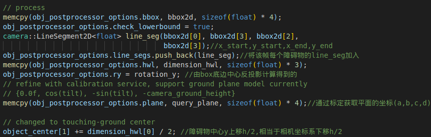
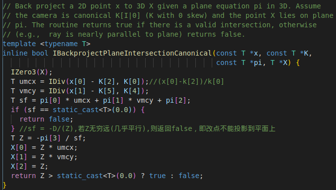

---

title: Apollo中障碍物后处理
categories:
- apollo
- perception
tags:
- 障碍物检测
mathjax: true
---

Apollo中障碍物后处理

<!--more-->

## 对检测到的障碍物进行后处理的条件

- bbox位于roi区域内(位于这一区域的其更容易投影到地平面)
- 障碍物的中心距离相机中心大于阈值(30)



## 后处理的初始参数配置



`object_center[1] +=dimension_hwl[0] / 2`则此时中心点接触地面 (即车辆坐标系中心下移至平面)

## PostProcessObjWithGround

```c++
postprocessor_->PostProcessObjWithGround(
        obj_postprocessor_options, object_center, dimension_hwl, &rotation_y);
//函数功能定义
bool ObjPostProcessor::PostProcessObjWithGround(
    const ObjPostProcessorOptions &options, float center[3], float hwl[3],
    float *ry) {
  memcpy(hwl, options.hwl, sizeof(float) * 3);
  float bbox[4] = {0};
  memcpy(bbox, options.bbox, sizeof(float) * 4);
  *ry = options.ry;

  // soft constraints
  bool adjust_soft =
      AdjustCenterWithGround(bbox, hwl, *ry, options.plane, center);
  if (center[2] > params_.dist_far) {
    return adjust_soft;
  }

  // hard constraints
  bool adjust_hard = PostRefineCenterWithGroundBoundary(
      bbox, hwl, *ry, options.plane, options.line_segs, center,
      options.check_lowerbound);

  return adjust_soft || adjust_hard;
}
```

具体的的处理算法有两种：

- **AdjustCenterWithGround**:软约束--通过中心点投影位于平面内的约束进行中心点的更新。

  部分主要处理函数如下

  ```c++
  iou_ini = GetProjectionScore(ry, bbox, hwl, center); //获取角点投影box和检测box的交并比初始值
  ...
  //开始更新中心坐标
  while(!stop){
      common::IProjectThroughIntrinsic(k_mat_, center, x); //center投影到图像坐标系 x
      x[0] *= common::IRec(x[2]);
      x[1] *= common::IRec(x[2]);//齐次坐标
      bool in_front = common::IBackprojectPlaneIntersectionCanonical(
          x, k_mat_, plane, center_test);//再将此中心点根据平面约束投影回3d空间->center_test
      ...
      float iou_cur = GetProjectionScore(ry, bbox, hwl, center);
      float iou_test = GetProjectionScore(ry, bbox, hwl, center_test);
          float dist = common::ISqrt(common::ISqr(center[0] - center_test[0]) +
                                 common::ISqr(center[2] - center_test[2]));//检测得到的center与平面内的center_test的距离
      float cost_cur = dist + WEIGHT_IOU * (1.0f - (iou_cur + iou_test) / 2);
      // std::cout << "cost___ " << cost_cur << "@" << iter << std::endl;
      if (cost_cur >= cost_pre) {
        stop = true;
      } else {
        cost_delta = (cost_pre - cost_cur) / cost_pre;
        cost_pre = cost_cur;
        center[0] += (center_test[0] - center[0]) * lr;
        center[2] += (center_test[2] - center[2]) * lr; //更新center,与之前"Transform模块中的center更新相似",此时的依据是点的反投影位于平面
        ++iter;
        stop = iter >= MAX_ITERATION || cost_delta < EPS_COST_DELTA ||
               cost_pre < MIN_COST;
      }
      lr *= params_.learning_r_decay; 
  }
   float iou_res = GetProjectionScore(ry, bbox, hwl, center);
    if (iou_res < iou_ini * params_.shrink_ratio_iou) { //0.9 IOu缩小比率，更新完center后若其iou反而缩减到原iou的0.9以下，则还是用初始值
      memcpy(center, center_input, sizeof(float) * 3);
      return false; //更新失败
    }
    return true;
  
  ```

  

  由内参所表示的反投影关系：(x,y)->(X,Y,Z)
  $$
  X=\frac{x-c_x}{f_x}*Z=umcx*Z\\
  Y=\frac{y-c_y}{f_y}*Z=vmcy*Z\\
  $$
  若X,Y,Z位于平面AX+BY+CZ+D=0内，则
  $$
  A*umcx*Z+B*vmcy*Z+C*Z+D=0\\
  A*umcx+B*vmcy+C=-\frac{D}{Z}
  $$
  
- **PostRefineCenterWithGroundBoundary**硬约束--

  该函数通过`line_segs`(内部存储了当前帧检测物体的2D框信息),

  部分主要处理如下:

  ```c++
   // hard constraints
  bool adjust_hard = PostRefineCenterWithGroundBoundary(
        bbox, hwl, *ry, options.plane, options.line_segs, center,
        options.check_lowerbound);
  //该函数主要处理流程如下：
  ```

  GetDxDzForCenterFromGroundLineSeg 

  先通过平面约束得到2d box (两点)在 3d中的反投影，即将bbox2d中的两个点反投影到了3d平面中。

  将坐标系转为车辆坐标系

  得到障碍物中心与车辆中心的直线方程

  

  

  
  
  ```c++
  template <typename T>
  void UpdateOffsetZ(T x_start, T z_start, T x_end, T z_end,
                     const std::pair<T, T> &range, T *z_offset) {
    CHECK(range.first < range.second);
    if (x_start > x_end) {
      std::swap(x_start, x_end);
      std::swap(z_start, z_end);
    }
  
    T x_check_l = std::max(x_start, range.first);
    T x_check_r = std::min(x_end, range.second);
    T overlap_x = x_check_r - x_check_l;
    if (overlap_x < 1e-6) {
      return;
    }
  
    T dz_divide_dx = (z_end - z_start) * common::IRec(x_end - x_start);
    T z_check_l = z_start + (x_check_l - x_start) * dz_divide_dx;
    T z_check_r = z_start + (x_check_r - x_start) * dz_divide_dx;
    T z_nearest = std::min(z_check_l, z_check_r);
    if (z_nearest < *z_offset) {
      *z_offset = z_nearest;
    }
  }
  ```
  
  
  
  