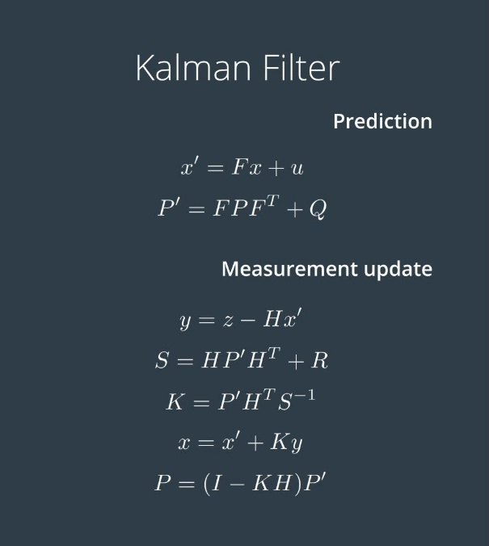

---

title: Apollo中radar的相关算法
categories:
- autonomous
- apollo
tags:
- apollo
- radar
mathjax: true
---

apollo中radar的目标检测与跟踪算法

<!--more-->

Apollo中`radar_detection_component`的算法处理入口为`Proc` ,根据该组件对应`dag`文件中的`reader`,在初始化组件时，`class RadarDetectionComponent : public cyber::Component<ContiRadar>`，该组件继承了含有一个message消息的`Component`基类，因此在该类初始化时，会创建接收`ContiRadar`消息类型的`reader`，回调函数为`Proc`。

Proc的输入信息(input_message)包括了：

- `apollo::drivers::ContiRadar`
- `apollo::localization::LocalizationEstimate`

输出信息(out_message)包括了：

- `SensorFrameMessage` 


## 预处理

```c++
  // @brief: correct radar raw obstacles.
  // @param [in]: raw obstacles from radar driver.
  // @param [in]: options.
  // @param [out]: corrected radar obstacles
  virtual bool Preprocess(const drivers::ContiRadar& raw_obstacles,
                          const PreprocessorOptions& options,
                          drivers::ContiRadar* corrected_obstacles) = 0;
```


- **SkipObjects**(raw_obstacles,corrected_obstacles)

  ```c++
  // @brief: 根据时间戳过滤检测物体
  // @param [in]: raw obstacles from radar driver.
  // @param [out]: corrected radar obstacles
  void ContiArsPreprocessor::SkipObjects(
      const drivers::ContiRadar& raw_obstacles,
      drivers::ContiRadar* corrected_obstacles){...}
  ```

  判断每个原检测物体的时间戳，若该检测物体的时间戳在该数据帧时间戳的`(-1e6,0.074)`之间则进行处理。

-  **ExpandIds**(corrected_obstacles)

  ```c++
  // @brief: 创建全局id
  // @param [in]: corrected radar obstacles
  // @param [out]: corrected radar obstacles
  void ContiArsPreprocessor::ExpandIds(drivers::ContiRadar* corrected_obstacles) {...}
  ```

  为corrected obstacles分配id:若目标的`meas_state`属性为`CONTI_NEW`即新创建的目标或者corrected obstacles的id未出现过，则为其添加一个，最终当所有的object_id都出现过`local2global_[ORIGIN_CONTI_MAX_ID_NUM]`将不再变化，同时每个object_id都对应一个固定的id。

- **CorrectTime**(corrected_obstacles)

  ```c++
  // @brief: 校正时间戳延迟
  // @param [in]: corrected radar obstacles
  // @param [out]: corrected radar obstacles
  void ContiArsPreprocessor::CorrectTime(
      drivers::ContiRadar* corrected_obstacles) {...}
  ```

  通过初始化配置时的参数`delay_time_`(0.07)校正时间戳。


## Radar Perception


### InitOptions

初始化检测器配置:`DetectorOptions detector_options`

```c++
struct DetectorOptions {
  Eigen::Matrix4d* radar2world_pose = nullptr;	  //到世界坐标系下的转换
  Eigen::Matrix4d* radar2novatel_trans = nullptr; //到定位模块的转换
  Eigen::Vector3f car_linear_speed = Eigen::Vector3f::Zero(); //车辆线速度
  Eigen::Vector3f car_angular_speed = Eigen::Vector3f::Zero(); //车辆角速度
  base::HdmapStructPtr roi = nullptr; //高清地图提供的roi
};
```

通过`TransoforWrapper`类根据当前的时间戳分别查询实时的转换矩阵`radar2worlld_pose` `radar2novatel_trans`
同时通过`GetCarLocalizatonSpeed`通过监听节点`localization_subscriber_`获取实时的车辆的线速度和角速度。

初始化`RoiFiler`的配置：` RoiFilterOptions roi_filter_options`

```c++
struct RoiFilterOptions {
  base::HdmapStructPtr roi = nullptr;
};
```

初始化一个指向`HdmapStruct`的指针:

```c++
struct alignas(16) HdmapStruct {
  std::vector<RoadBoundary> road_boundary; //道路左右边界
  std::vector<PointCloud<PointD>> road_polygons; //道路的区域
  std::vector<PointCloud<PointD>> hole_polygons; //
  std::vector<PointCloud<PointD>> junction_polygons; //道路交叉区域
};
```

根据之前初始化时导入的`hd_map`文件，获取Roi区域:

```c++
// @brief: 获取Roi区域(道路边界) 包含road_boundary,road_polygons,hole_polygons,junction_polygons
// @param [in]: pointd(radar相对于世界坐标系原点的位置)
// @param [in]: distance(radar前向探测距离 )
// @param [out]: hdmap_struct_ptr(对应于roi的hd_map数据结构)
bool HDMapInput::GetRoiHDMapStruct(
    const base::PointD& pointd, const double distance,
    std::shared_ptr<base::HdmapStruct> hdmap_struct_ptr){
    
     // @brief: 获取道路边界和交叉口
	 // @param [in]: point(radar相对于世界坐标系原点的位置)
	 // @param [in]: distance(radar前向探测距离 )
	 // @param [out]: road_boundary_vec 
     // @param [out]: junctions_vec 
     if (hdmap_->GetRoadBoundaries(point, distance, &road_boundary_vec,
                                &junctions_vec) != 0){ .. }
     ...
      // Merge boundary and junction
      std::vector<RoadBoundary> road_boundaries;
      MergeBoundaryJunction(road_boundary_vec, junctions_vec, &road_boundaries,
                            &(hdmap_struct_ptr->road_polygons),
                            &(hdmap_struct_ptr->junction_polygons));
      // Filter road boundary by junction
      GetRoadBoundaryFilteredByJunctions(road_boundaries,
                                         hdmap_struct_ptr->junction_polygons,
                                         &(hdmap_struct_ptr->road_boundary));
	
    
    }
```

**到此，将detector的配置(主要是坐标的变换矩阵)和roi_filter的配置(主要是道路边界的获取)初始化完成，接下来是感知算法的实现。**

```c++
// @brief: 检测和跟踪算法的实现
// @param [in]: corrected_obstacles(经过preprocess之后的radar检测物体)
// @param [in]: options(detector,roifilter,tracker,sensor_name)等的初始化配置
// @param [out]: objects(最终得到的检测物体信息)
bool RadarObstaclePerception::Perceive(
    const drivers::ContiRadar& corrected_obstacles,
    const RadarPerceptionOptions& options,
    std::vector<base::ObjectPtr>* objects) {...}
```

### Detctor:

```c++
// @brief: 在预处理后的corrected_obstacle上检测物体
// @param [in]: corrected_obstacles(经过preprocess之后的radar检测物体)
// @param [in]: options(detector的初始化配置)
// @param [out]: radar_frame(带有所有障碍物信息的frame)
// @note: frame数据类型根据传感器类型和时间戳封装了object数据类型，而SensorFrameMessage又
// 进一步封装了frame数据类型用于各传感器相互之间的信息融合消息类型
bool Detect(const drivers::ContiRadar& corrected_obstacles,
              const DetectorOptions& options,
              base::FramePtr radar_frame){
    
    // @brief: 将检测物体添加到radar_frame中
	// @param [in]: corrected_obstacles(经过preprocess之后的radar检测物体)
	// @param [in]: options(detector的初始化配置)
	// @param [out]: radar_frame(带有所有障碍物信息的frame)	
    RawObs2Frame(corrected_obstacles, options, radar_frame);
    
}
```

在`RawObs2Frame`的具体算法中：
首先根据车辆角速度(novatel坐标系下)计算得到旋转矩阵`rotation_novatel`,然后再根据`novatel`和`radar`之间的旋转关系计算得到`radar`坐标系下的角速度矩阵,由于角速度是局部坐标系`东-北-天`下的，因此其角速度矩阵也为相对于该坐标系下。然后，对于`corrected_obstacles`中的每一个检测物体：

```c++
  //                x axis  ^
  //                        | longitude_dist
  //                        |
  //                        |
  //                        |
  //          lateral_dist  |
  //          y axis        |
  //        <----------------
  //        ooooooooooooo   //radar front surface
```

- 将目标在radar下的(x,y)坐标转换到统一的世界坐标系(UMT)下存储到object->center中
  `radar_object->center = radar2world * local_loc`
  `radar_object->anchor_point = radar_object->center`

- 将radar坐标系下的横轴和纵轴速度转换到世界(相对于东-北-天坐标系)下的速度:

  不同坐标系下角速度或线速度的相互转换需要乘上对应的旋转矩阵，因此由于`radar`直接得到的是目标相对`radar`的相对速度，需要将其检测目标的速度转换到(东-北-天)坐标系下,首先得到`radar`在(东-北-天)坐标系下由于车辆角速度引起的旋转：

  ```c++
  rotation_novatel << 0, -angular_speed(2), angular_speed(1), angular_speed(2),
        0, -angular_speed(0), -angular_speed(1), angular_speed(0), 0; //角速度矢量的反对称阵
  rotation_radar = radar2novatel.topLeftCorner(3, 3).inverse() *
                                     rotation_novatel *
                                     radar2novatel.topLeftCorner(3, 3);
  
  angular_trans_speed = rotation_radar * local_loc.topLeftCorner(3, 1);//
  world_vel = radar2world_rotate * (local_vel + angular_trans_speed);
  vel_temp =  world_vel + options.car_linear_speed.cast<double>();
  ```

  `radar_object->velocity = vel_temp`
  **注意线速度等于角速度叉乘失径，此处叉乘通过矩阵相乘实现，即为:**
  $$
  \vec{a}\times\vec{b}=
  \begin{bmatrix}
  0&-a_3&a_2\\
  a_3 & 0 &-a_1\\
  -a_2 & a_1 & 0
  \end{bmatrix}\vec{b}\triangleq a^{\land}\vec{b}
  $$
  
- 将`corrected_obstacles`中的横纵向距离和速度的标准差(`dist_rms/vel_res`)作为位置和速度不确定度：
  `radar_object->center_uncertainty = radar2world_rotate * dist_rms * dist_rms.transpose() * radar2world_rotate.transpose()`
  `radar_object->velocity_uncertainty =`radar2world_rotate * vel_rms * vel_rms.transpose() *`  
  radar2world_rotate.transpose()`

- 将原检测信息中目标的旋转角度(单位为度，逆时针旋转为正方向)转为弧度，并转换为方向向量,然后将此方向向量转换到世界坐标系下:

  ```c++
      double local_obj_theta = radar_obs.oritation_angle() / 180.0 * PI;
      Eigen::Vector3f direction(static_cast<float>(cos(local_obj_theta)),
                                static_cast<float>(sin(local_obj_theta)), 0.0f);
      direction = radar2world_rotate.cast<float>() * direction;
  ```

  `radar_object->direction = direction`
  `radar_object->theta = std::atan2(direction(1),direction(0))`

  角度的不确定度由检测信息中的`oritation_angle_rms`标准差确定，也是将角度改为弧度：
  ` radar_object->theta_variance = (radar_obs.oritation_angle_rms() / 180.0 * PI)`

- 置信度设置为原检测信息中的`probexist`,即目标存在的概率：
  `radar_object->confidence = radar_obs.probexist()`

- 根据原检测信息中的`dynprop`属性进行确定目标的运动状态(相对于东-北-天坐标系(或者说相对于地面))是运动，静止，还是未知的,若是静止的，将速度置零。

- 根据原检测信息中的`obstacle_class`确定目标的类别。

- 根据原检测信息中的`length`,`width`确定目标的长度和宽度，因为`radar`无法检测高度信息，将此值设置为车辆模板 2m ,同时对于物体类别未知的点`CONTI_POINT`，将size设置为1.0m 。

- 最后根据相对`radar`的物体的x,y坐标，计算距离$local\_range\sqrt{(x^2+y^2)}$ ，即角度$local\_angle = arctan(y/x)$作为radar检测目标的补充参数`radar_supplement`。

### RoiFilter(HdmapRadarRoiFilter)

```c++

// @brief: fliter the objects outside the ROI 过滤出roi区域之外的物体
// @param [in]: options.(hdmap_input信息)
// @param [in / out]: origin total objects / the objects in the ROI.
bool RoiFilter(const RoiFilterOptions& options,
                 base::FramePtr radar_frame) override;
```

若`roimap`中存在有效信息，该函数根据目前检测物体的中心点坐标判断是否位于roi 的`road` 或者`juction`的polygons中,若目标中心点位于ROI的polygons中，则将该物体添加到`valid_objects`中。

### Track()

```c++
// @brief: 
// @param [in]: options.
// @param [in]: detected_frame(the objects in the ROI)
// @param [in / out]: tracked_frame (被跟踪物体的信息)
bool Track(const base::Frame &detected_frame, const TrackerOptions &options,
             base::FramePtr tracked_frame)
```

- **TrackObjects(detected_frame)** 获取跟踪目标tracks

  首先跟踪目标的基本信息单位由封装`object`的`RadarTrack`定义，而该单元的删除和创建由封装了`RadarTrack`的`RadarTrackManager`管理(获取,改变,添加,删除track)，算法的具体由`ContiArsTracker`实现。

  (1) **获取当前跟踪的物体** GetTracks() 

  (2) **匹配** matcher_->Match
  由hm_matcher进行检测物体与跟踪物体的关联。

  ```c++
  // @brief match radar objects to tracks
  // @params[IN] radar_tracks: global tracks
  // @params[IN] radar_frame: current radar frame
  // @params[IN] options: matcher options for future use
  // @params[OUT] assignments: matched pair of tracks and measurements
  // @params[OUT] unassigned_tracks: unmatched tracks
  // @params[OUT] unassigned_objects: unmatched objects
  // @return nothing
  virtual bool Match(const std::vector<RadarTrackPtr> &radar_tracks,
                     const base::Frame &radar_frame,
                     const TrackObjectMatcherOptions &options,
                     std::vector<TrackObjectPair> *assignments,
                     std::vector<size_t> *unassigned_tracks,
                     std::vector<size_t> *unassigned_objects) {
      return true;
  }
  ```

  方法是首先由于radar原始输出信息中包含了object_id(注意原始radar信息同一id不一定是同一物体)，但是作为一项判断依据，即进行`IDMatch`的匹配，同时还要求object和track的距离小于一定阈值,其中$c_2$ $c_1$分别表示object和track的中心点位置,$f(c)=\sqrt{x^2+y^2+z^2}$
  $$
  0.5*f\{(c_2-(c_1+v_1\times\triangle t))\}+0.5*f\{(c_1-(c_2+v_2\times\triangle t))\}<2.5m
  $$
  满足上述两个条件将对应索引的object关联到track中保存到`assignments`，并将未匹配的object或track的索引保存到
  `unassigned_objects`和`unassigned_tracks`中。

  然后将剩下的未分配的object和track建立`association_matrix`通过`gated_hungarian_matcher`进行进一步匹配，并将索引保存到`assignments`中，将此时未分配的`track`和`object`索引分别保存到`unassigned_tracks`和
  `assigned_objects`中。

  (3) **更新已匹配的tracks** `UpdateAssignedTracks`
  	将已经有了新的匹配的tracks信息更新到当前新检测的object,更新信息包括目标的中心位置(x,y)速度($v_x,v_y$),时间戳，如果采用`Adaptive_Kalman_filter`,则先经过卡尔曼滤波器的校正然后再更新信息,最后将`tracked_times`加1,以及跟踪的生命周期`tracking_time_+=time_diff`

  (4) **更新未匹配的tracks** `UpdateUnassignedTracks`
  	对于所有未匹配`object`的`track`，判断其与当前帧的时间戳之差是否大于0.06s(即超过0.06s未有检测匹配),若是则将其`SetDead`,当然，若此未分配的`track`是一个空壳(没有跟踪目标信息),也将其设置为`dead`。

  (5) **删除跟丢的tracks** `DeleteLostTracks`
  	判断当前所有的`tracks`，若其`is_dead`则将其从`tracks`列表中删除。

  (6) **创建新的track** `CreateNewTracks`
  	对于剩下的未分配的`object`,将其创建新的`track`加入到`tracks`中。

- **CollectTrackedFrame(tracked_frame)** 将`RadarTrack`数据类型中的对应数据转换到`Frame`数据结构中

  (1) **跟踪确认** `ConfirmTrack`
  	对于`tracked_times>=3`的track,即有超过三次匹配到`object`，则认为是有一定可靠度的进行下一步处理

  (2) **添加到tracked_frame** 
  	将`RadarTrack`中的对应信息复制到`tracked_frame`帧数据结构中，以进行传输。


## Radar algorithm supplement

### 1.Adaptive Kalman Filter

`radar`或`camera`在进行目标检测时，由于外界环境的突然变化(光照，路面剧烈波动，上下坡等)导致传感器的检测精度受到影响，由于传统的KalmanFilter的更新依赖于先验的量测噪声协方差阵$R$和过程噪声协方差阵$Q$,那么此时传感器检测受到影响，而`Q,R`却并没有改变，即此时系统模型不准确，那么KalmanFilter的结果必然是存在问题的。
对于自适应卡尔曼滤波，

状态向量:
$$
X=
\begin{bmatrix}
c_x\\
c_y\\
v_x\\
v_y
\end{bmatrix}
$$
状态转移矩阵:
$$
F=
\begin{bmatrix}
1 & 0 & \triangle t & 0\\
0 & 1 & 0 & \triangle t \\
0 & 0 & 1 & 0\\
0 & 0 & 0 & 1

\end{bmatrix}
$$
过程噪声协方差矩阵：
$$
Q=
\begin{bmatrix}
0.074 & 0 & 0 & 0\\
0 & 0.074 & 0 & 0 \\
0 & 0 & 0.074 & 0\\
0 & 0 & 0 & 0.074
\end{bmatrix}
$$
量测噪声协方差矩阵：根据radar返回的横纵向速度和位置的标准差rms计算得到世界坐标系下的协方差。

```c++
dist_rms(0, 0) = radar_obs.longitude_dist_rms(); //纵向距离的标准差
    dist_rms(1, 1) = radar_obs.lateral_dist_rms(); //横向距离标准差
    vel_rms(0, 0) = radar_obs.longitude_vel_rms(); //纵向速度的标准差
    vel_rms(1, 1) = radar_obs.lateral_vel_rms(); //横向速度标准差
    radar_object->center_uncertainty =
        (radar2world_rotate * dist_rms * dist_rms.transpose() *
         radar2world_rotate_t) //世界坐标系下的协方差(R*rms)(R*rms)^T
            .cast<float>();

radar_object->velocity_uncertainty =
    (radar2world_rotate * vel_rms * vel_rms.transpose() *
     radar2world_rotate_t)
    .cast<float>();
```

$$
R=
\begin{bmatrix}
c_{x\ uncertainty} & 0 & 0 & 0\\
0 & c_{y\ uncertainty} & 0 & 0 \\
0 & 0 & v_{x\ uncertainty} & 0\\
0 & 0 & 0 & v_{y\ uncertainty}
\end{bmatrix}
$$

**预测部分**:
$$
x'=Fx\\
P'=FPF^T+Q
$$
**更新部分**:
首先根据该帧检测物体的位置速度的不确定性协方差阵更新`R`

```c++
  r_matrix_.topLeftCorner(2, 2) =
      new_object.center_uncertainty.topLeftCorner(2, 2).cast<double>();
  r_matrix_.block<2, 2>(2, 2) =
      new_object.velocity_uncertainty.topLeftCorner(2, 2).cast<double>();
```

$$
y = z-Hx'\\
S = HP'H^T+R\\
K=P'H^TS^{-1}\\
x=x'+Ky\\
P=(I-KH)P'(I-KH)^T+KRK^T
$$

其中$P=(I-KH)P'(I-KH)^T+KRK^T$与$P=(I-KH)P'$等价，但是能够保证正定性。



可以看出毫米波雷达的卡尔曼滤波相较于传统的滤波器，**在于其`R`阵会根据`radar`提供的标准差实时更新**。

### 2. GatedHungarianMatcher

