---

title: Apollo 中的跟踪算法
categories:
- Apollo
tags:
- track
mathjax: ture
---

Apollo中的检测算法

<!--more-->

跟踪的基本成员单位为封装object类为TrackObject类，最后`Target`类结构中包含`TrackObject`类及相关的估计方法。

## tracker_->Predict(frame):预测部分

在新图像中预测候选障碍物 将输出赋值给frame->proposed_objects

## extractor_->Extract(frame):特征提取部分

对每个检测到的对象进行特征提取

```c++
struct FeatureExtractorLayer {
  std::shared_ptr<inference::Layer<float>> pooling_layer;
  std::shared_ptr<base::Blob<float>> rois_blob;
  std::shared_ptr<base::Blob<float>> top_blob;
};
```

```c++
   feature_extractor_layer_ptr->pooling_layer->ForwardGPU(
        {feat_blob_, feature_extractor_layer_ptr->rois_blob},
        {frame->track_feature_blob});
```

其中`feat_blob_`的现行定义是:

```protobuf
feat_stride: 32
extractor {
  feat_blob: "conv4_3"
  feat_type: ROIPooling
  roi_pooling_param {
      pooled_h: 3
      pooled_w: 3
      use_floor: true
  }
}
```

这样根据feat_blob_以及rois_blob(由bbox位置确定)进行`ROIPooling`将最终pool得到的最大值存到track_feature_blob中。

## tracker_->Associate2D(frame):根据2D信息关联

### 该部分的主要成员变量

1. 成员类帧列表:`FrameList` 包装了`CameraFrame`类

   ```c++
     int frame_count_ = 0; //添加帧的数量
     int capability_ = 0;	//容量(14)表示14帧后开始覆盖
     std::vector<CameraFrame *> frames_;
   ```

2. 相似性map:`SimilarMap` 存储blob的嵌套vector

   ```c++
     std::vector<std::vector<std::shared_ptr<base::Blob<float>>>> map_sim;
     int dim;//=omt_param_.img_capability()=14
   ```

3. 相似性计算`BaseSimilar`  `std::shared_ptr<BaseSimilar> similar_`


​	其中GPUSimilar用到了BLAS(线性代数)库:https://blog.csdn.net/cocoonyang/article/details/58602654?depth_1-utm_source=distribute.pc_relevant.none-task&utm_source=distribute.pc_relevant.none-task

4. `Target`类包含了跟踪物体的id和相关的状态信息,`tracked_objects`包含了被跟踪的物体vector,是`TrackObject`类
   `Target`类为期望得到检测框匹配的跟踪物体

   

5. `TrackObject`类则封装了跟踪目标`Object`类，记录该跟踪目标对应的帧id和传感器名称,是跟踪目标的最小封装单位

   ```c++
   struct TrackObject {
     PatchIndicator indicator; //保存了传感器的名称和目标在帧中的id
     double timestamp;
     base::BBox2DF projected_box;//由检测得到的原2dbox　经projected_matrix投影得到障碍物的bbox 这个矩阵是啥意思不太清楚 narrow to obstacle projected_matrix(应该是为了将不同的相机的bbox统一到一个尺度)
     base::ObjectPtr object;
   };
   ```

6. `PatchIndicator`类主要包含了两个变量,重载运算符"=="为frame_id和patch_id分别相等

   ```c++
     int frame_id;//为该检测目标对应的是第几帧(frame id )
     int patch_id;//该检测目标在该帧中的id(object id)
     std::string sensor_name;//记录检测到的传感器名称
   ```

7. `ObstacleReference`类包含了与模板相关的参数：

   

8. `reference`类

   ```c++
   struct Reference {
     float area = 0.0f;
     float k = 0.0f;
     float ymax = 0.0f;
   };
   ```

9. `CameraGroundPlaneDetector`类，地平面检测的相关方法

   

### 2D关联算法的实现

1. 计算各帧与当前帧的余弦相似性:（第5步target和det_obj的Apperance的匹配分数会用到）
2. 从已跟踪物体列表中去除最早帧之前的帧中检测到的目标
3. 根据当前帧的检测物体，得到当前的检测跟踪列表

  ```c++
  for(...){
      ...
  	ProjectBox(frame->detected_objects[i]->camera_supplement.box,
               frame->project_matrix, &(track_ptr->projected_box));//图像2dbox投影到障碍物坐标系
  	track_objects.push_back(track_ptr);
  }
  ```

4. 校正当前帧检测目标的三维尺寸，执行了四种校正方式：分别为模板，参考地平面，标定，历史信息

  ```c++
  reference_.CorrectSize(frame); //
  ```

  - 根据模板的最小最大尺寸校正检测目标的最小最大尺寸。(TypeRefinedBy**Template**)

  - 根据障碍物参考校正检测目标的尺寸,可作为参考的目标类型类`CAR,VAN`,同时还需要一系列附加条件，可详见`ObstacleReference::UpdateReference(...)`

    (1). 根据sensor_name的不同 初始化ground_estiomator,执行`GameraGroundPlaneDetector`类的初始化:

    ```c++
    SyncGroundEstimator(sensor, frame->camera_k_matrix,
                              static_cast<int>(img_width_),
                              static_cast<int>(img_height_));
    ```

    该函数实际上执行`GameraGroundPlaneDetector`类的初始化,有相机内参相关参数初始化

    ```c++
    ground_estimator.Init(k_mat, img_width, img_height, common::IRec(fx));
    ```

    (2). 

    ```c++
    ground_estimator.GetGroundModel(l)
    ```

    通过相机pitch和相机height(通过calibration获取)获取平面$$a*X+b*Y+c*Z+d=0$$ （相机坐标系）

  - 通过标定服务校正高度h

  - 通过历史参考校正高度h

  

  

  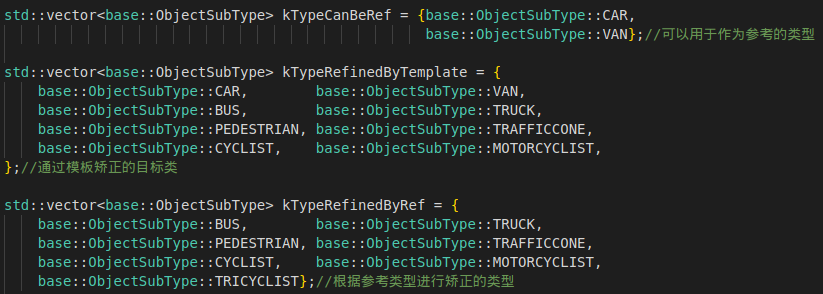

>
> 此处矫正的三维尺寸在后面的`Transform`部分是否也被采用

5. 生成假设

   ```c++
   // @brief: 评估新检测目标与targets的相似性
   // @param [in]: track_objects :该帧检测器新检测到的目标
   // @param [in/out]: 
   // output:target匹配第(frame_id)帧中的第几个检测物(track_object),
   //        并将该track_object加入到target的tracked_objects中
   GenerateHypothesis(track_objects);
   ```

   其中对应的主要成员变量类型`Hypothesis`的定义为:（此为target和object的）

   

   处理函数：

   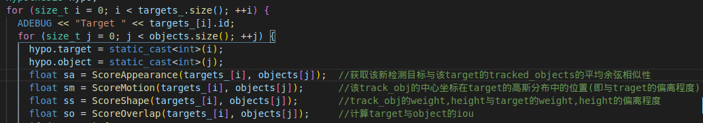

   得到target与对应det_obj的匹配分数后，根据分数由大到小分配,最终将检测物体(det_obj)加入到匹配分数最高的target的tracked_objects中。

   ```c++
   target.Add(det_obj); 
   //将det_obj添加到给定的target的tracked_objects中,并将该target的lost_age清零
   ```

   除了上面的四个分数，最终score还需要加上不同物体类型切换的代价值。

   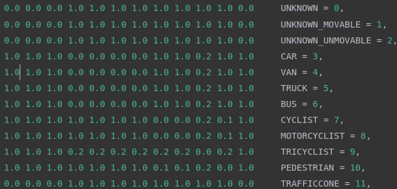

2. 创建新跟踪目标(target)

   ```c++
   int new_count = CreateNewTarget(track_objects);
   ```

   由`track_objects`创建新的跟踪目标的条件有：

   	1. 首先该det_obj与现有的target的匹配分数很小，即该det_obj与现有target匹配失败
    	2. 该det_obj的box需要是有效的(bbox宽高大于20同时小于图像宽高)
    	3. 该det_obj的box矩形没有被某个target的bbox覆盖 ,此处target的bbox指tracked_objects中最近检测的bbox
    	4. 在上述条件都满足的前提下，需满足det_obj的高度大于最小模板的高度,也可以是未知类型(此时高度的模板未知)

7. 超过存活周期(lost_age>5)的target,否则执行(即正常跟踪的target)下列方法，通过`latest_object`进行相应更新.并调用对应的`滤波方法`进行预测

   ```c++
   target.UpdateType(frame);
   target.Update2D(frame);
   ```

   - **UpdateType():**

     对于未丢失检测(lost_age=0)的target:

     1. 计算该target的最近检测目标(latest_object->object)的高度与模板中等尺寸的高度接近程度,接近程度由高斯分布衡量:

     ```c++
     //~N(mu=1.0,sigma=0.3)  反映了object的box_height与模板中等高度的接近程度
     float alpha = gaussian(
             rect.height /
                 (50 * (kMidTemplateHWL.at(object->sub_type).at(0) + 0.01f)),
             1.0f, target_param_.type_filter_var());
     //该target同类型的probs会往上叠加(在不同帧之间)，因为每帧该target都有一个对应的latest_object
     type_probs[static_cast<int>(object->sub_type)] += alpha; 
     ```

     根据上述最大的`type_probs`更新target的对应目标类型

     2. 将上述(alpha, object->size(0), object->size(1),object->size(2))组成4维向量，将此测量量添加到该target的`MaxNMeanFilter world_lwh`及`MeanFilter world_lwh_for_unmovable`中：

     ````c++
     world_lwh.AddMeasure(size_measurement); //MaxNMeanFilter window=15 根据alpha由大到小
     world_lwh_for_unmovable.AddMeasure(size_measurement); //测量值的均值和方差
     ````

     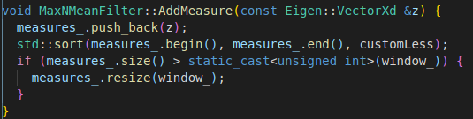

     这一步将得到该target 的15次测量值，按照alpha由大到小排序，并取平均更新3d object size,其中的object为该target的lastest_obj

     ```c++
         if (object->type == base::ObjectType::UNKNOWN_UNMOVABLE) {
           object->size =
               world_lwh_for_unmovable.get_state().block<3, 1>(1, 0).cast<float>();
         } else {
           object->size = world_lwh.get_state().block<3, 1>(1, 0).cast<float>();
         }
     ```

     > camera:
     >
     > 6mm : reliable z is 40(m) ,intrinsic(f) is approximate is 2000(像素)
     >
     > 12mm:reliable z is 80(m),instrinsic(f) is approximate si 4000(像素) 

   - **Update2D():** 更新2d box的大小。

     1. 向滤波器中添加测量值,进行滤波计算

        ```c++
            measurement << rect.width, rect.height;
            image_wh.AddMeasure(measurement);//一阶低通filter
            measurement << center.x, center.y;
            image_center.Correct(measurement);//Kalman_Filter
        ```

     2. 更新:得到该target最近最近检测物体(latest_object)的projected_box(单位：米)

        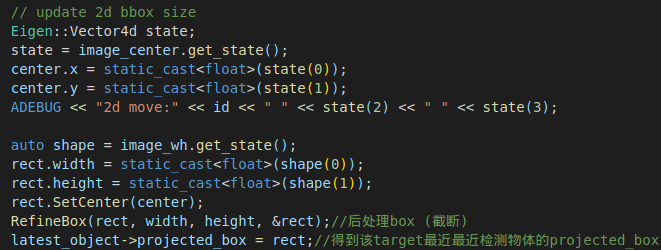

   8. 在Association之后通过IOU合并重复的targets(可能是不同相机得到的)

      ```c++
      CombineDuplicateTargets();
      ```

      - 对目前的targets_两两之间计算其各自含有的tarcked_objects之间的IOU以及box宽和高的差异，计算得到score (此处计算的tracked_object要求他们的时间戳之差小于0.05，同时来自不同传感器)

        ```c++
        score += common::CalculateIOUBBox(box1, box2); 
        ...
        score -= std::abs((rect1.width - rect2.width) *
                                      (rect1.height - rect2.height) /
                                      (rect1.width * rect1.height));
        ```

        将最终平均得分作为这两个`target`之间的相似程度，并将结果保存到score_list中(包括了两个target的索引及其得分)

      - 按照得分从大到小排序依次匹配，可以看出这一步骤与`OMTObstacleTracker::GenerateHypothesis()`相似不同的是我们这里要删除匹配成功的两个target中`id`大的那个,并将删除的那个target_del中的tracked_obj转移到target_save中。

        ```c++
            if (targets_[pair.target].id > targets_[pair.object].id) {
              index1 = pair.object;
              index2 = pair.target;
            }
            Target &target_save = targets_[index1];
            Target &target_del = targets_[index2];
            for (int i = 0; i < target_del.Size(); i++) {
              // no need to change track_id of all objects in target_del
              target_save.Add(target_del[i]);
            }
        ```

        并将target_save(target的引用)中的tracked_objects按照帧id(frame id)由小到大排序，并更新lastest_object。

        ```c++
            std::sort(
                target_save.tracked_objects.begin(), target_save.tracked_objects.end(),
                [](const TrackObjectPtr object1, const TrackObjectPtr object2) -> bool {
                  return object1->indicator.frame_id < object2->indicator.frame_id;
                });//将targe_save中的tracked_objects按照帧的id由小到大排序
            target_save.latest_object = target_save.get_object(-1);
        ```

        然后将target_del中的tracked_objects给清零，最后调用`ClearTargets()`即可将`targets_`多余的target清除掉(将target从后往前填空)

   9. 对经过滤波处理的box(单位：米)映射回图像坐标系（像素）
      

      ​	


## tracker_->Associate3D(frame):根据3D信息关联

### 1. 更新reference

```c++
reference_.UpdateReference(frame,targets_);
```

其中包含的数据结构有：

```c++
struct Reference {
  float area = 0.0f; //box的面积
  float k = 0.0f;    //object.H/box.h
  float ymax = 0.0f; //box的bottom right
};//可参考的Target（CAR,VAN）所对应的属性
```

`Obstacle_reference`类中的主要参数:主要含义是`ref_map_`中存储了`reference_`对应元素的索引，即ref_map_中各个位置存储了索引，索引对应于`reference _`中的的对应Reference属性。

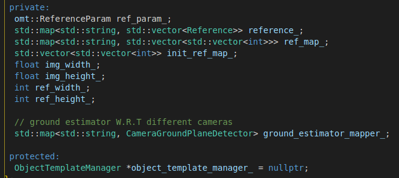

参数的相关默认值：

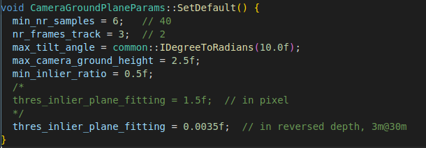

**`ObstacleReference::Init`的初始化中执行的操作：**
	将图像下采样(ref_width\_=width/25,ref_height\_=height/25),将init_ref_map的大小设置为(ref_height\_,ref_width_)的大小.然后对`init_ref_map`进行初始化,`init_ref_map`是一个嵌套vector结构,只对ref图像的下半部分处理，去除边缘，然后将这一部分区域的`init_ref_map`置为0，如蓝色区域所示。

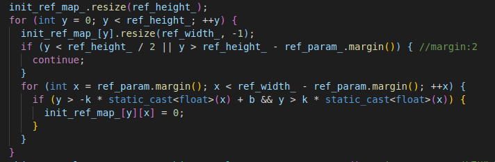

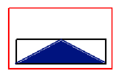

**`Reference update`中更新Reference中的相关参数**

- `reference_`中的所有reference的area每次更新衰减0.98

- ​    对于每个target中最近检测到的物体，如果是可以参考的类型(CAR,VAN)，同时其box的高度大于50，box的底边位置大于内参矩阵中的c_y(即box尽可能位于图像底部),此时该target可以被参考。将该box的底边中心点也进行下采样(y_discrete=y/25,x_discrete=x/25),这样可以与`ref_map`的尺寸对应。
  ​    如果此中心点所对应的`ref_map`为0(即该点对应的参考图第一次被使用)，将其对应的Reference信息push到数组`reference_`中存储，并将`ref_map`中对应位置置为当前`refs`存储的元素数(即将refs中对应的索引存储到ref_map的对应位置中);否则，若该点对应的ref_map大于零(表示该点已经存在某个物体，其中存储的值为当时的`refs`中对应的索引)，同时此时box的area大于之前存在的reference的area，则将属性进行替换。
  
  ```c++
  r.area = box.Area();
  r.ymax = y;
  r.k = obj->size[2] / (y - box.ymin); // H/h
  ```
  
  

**通过reference检测Ground**	

​	首先对于目前`refs`存储的所有`reference`，将其对应的box底边位置（y_max）以及深度倒数`1/z_ref`存储到`vd_samples`中,当reference的数量大于`min_nr_samples=6`时，可进行Ground的检测(需要在线标定的相机Pitch角度和相机离地平面的高度)

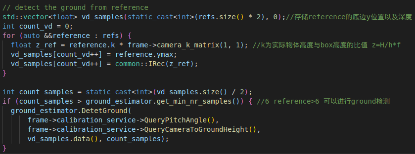

**DetetGround:**

若给定了相机坐标系下的平面，则由$Ax+By+Cz+D=0 -> a*y+b*disp+c=0$ : ground4->ground3:

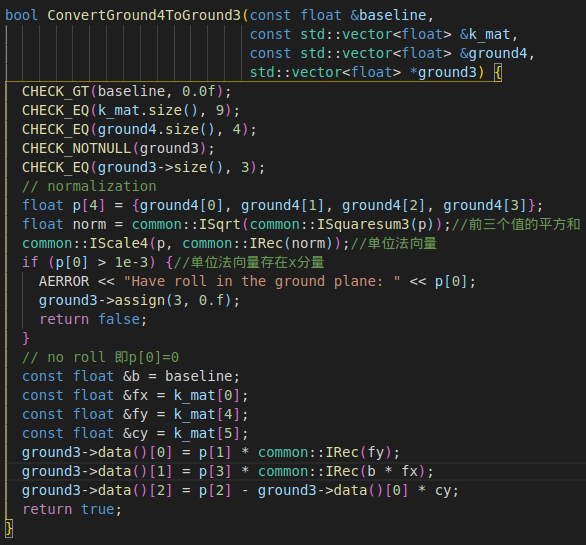

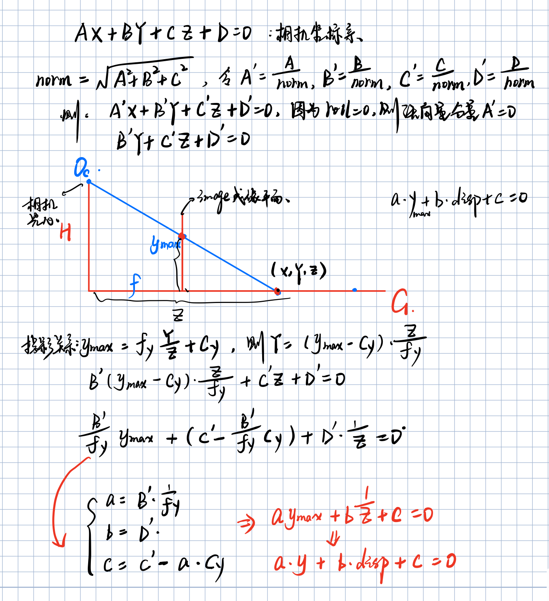

否则根据之前的存储的`reference`进行地平面的检测,`CameraGroundPlaneDetector::DetectGroundFromSamples()`

ground3与ground4的对应关系如上图所示，通过采样{y_max,1/z}即边界框下边界和深度的倒数即可通过一致性采样得到模型参数。

- **RobustBinaryFitRansac()**

   两个功能函数：

  - ```c++
    template <typename T>  //a*y+b*disp + c = 0->disp = p0*y+p1 通过采样点建立模型
    void GroundHypoGenFunc(const T *v, const T *d, T *p) {
      // disp = p0 * y + p1 -> l = {p0, -1, p1}
      T x[2] = {v[0], d[0]};
      T xp[2] = {v[1], d[1]};
      T l[3] = {0};
      common::ILineFit2d(x, xp, l);
      p[0] = -l[0] * common::IRec(l[1]);
      p[1] = -l[2] * common::IRec(l[1]);
    }
    ```

  - ```c++
    template <typename T> //平面拟合 代价函数
    void GroundFittingCostFunc(const T *p, const T *v, const T *d, int n,
                               int *nr_inlier,  // NOLINT compatible for i-lib
                               int *inliers,
                               T *cost,  // NOLINT
                               T error_tol) {
      *cost = static_cast<T>(0.0f);
      *nr_inlier = 0;
      const T *refx = v;
      const T *refp = d;
      for (int i = 0; i < n; ++i) {
        T d_proj = refx[0] * p[0] + p[1];
        T proj_err = static_cast<T>(fabs(d_proj - refp[0]));
        if (proj_err < error_tol) {
          inliers[(*nr_inlier)++] = i;
          *cost += proj_err;
        }
        ++refx;
        ++refp;
      }
    }
    ```

  以此为模板参数执行：

  ```c++
  common::RobustBinaryFitRansac<float, 1, 1, 2, 2,
                                GroundHypoGenFunc<float>,
                                GroundFittingCostFunc<float>, nullptr>(
            vs, ds, count_vd, p, &nr_inliers, inliers, kThresInlier, false, true,
            0.99f, kMinInlierRatio)
  ```

  ```c++
  //内部主要处理过程
  bool RobustBinaryFitRansac(...)
  {
     ...
     int nr_trials = IRansacTrials(s, confidence, inlierprob);//获取Ransac尝试次数 (此处是16)
      while (nr_trials > sample_count) {
          IRandomSample(indices, s, n, &rseed); //随机采样 从[0,n)中每次采2个索引
          ...
          HypogenFunc(samples_x, samples_xp, tmp_model); //通过两个采样点获取模型参数
          ...
          //通过其他样本数据，验证获取的模型参数，计算代价 error_tol=KThresInlier判断内点的阈值
          CostFunc(tmp_model, x, xp, n, &nr_inliers, inliers + n, &cost, error_tol);
      	if ((nr_inliers > *consensus_size) ||
          	(nr_inliers == *consensus_size && cost < best_cost)) {
        	*consensus_size = nr_inliers; //目前匹配的最多的内点数
        	best_cost = cost;
        	ICopy(tmp_model, model, k); //将匹配内点数最多的模型导出
          // record inlier indices 将匹配最多的模型的内点索引记录
        	ICopy(inliers + n, inliers, *consensus_size);  
        	if (adaptive_trial_count) { //自适应尝试
          	tmp_inlierprob = IDiv(static_cast<double>(*consensus_size), n);
          	if (tmp_inlierprob > actual_inlierprob) {
            		actual_inlierprob = tmp_inlierprob;
                  //调整(任意一个点为内点)的概率，以此调整trial次数
            		nr_trials = IRansacTrials(s, confidence, actual_inlierprob);
          }
        }
      }
      }
                                           
  }
  ```

- **ILineFit2dTotalLeastSquare**:最小二乘拟合
  最后根据这些内点进行最小二乘拟合,得到平面$a*y+b*disp + c = 0\ -> p0*y - disp +p1=0$

  ```c+++
  common::ILineFit2dTotalLeastSquare(vd, l_best, count);
  ```

-  **GetGroundPlanePitchHeight()**:将ground3平面转换为相机坐标系下的ground4,并得到相机高度(height)和角度(pitch):
  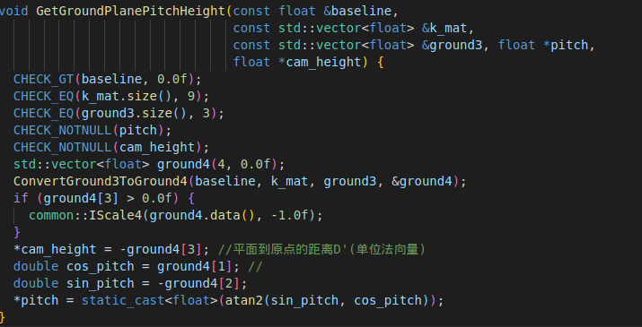

- **GroundPlaneTracker()**
  构造函数： 注意到tracker的存储是从后往前添加(低索引存储新值)

  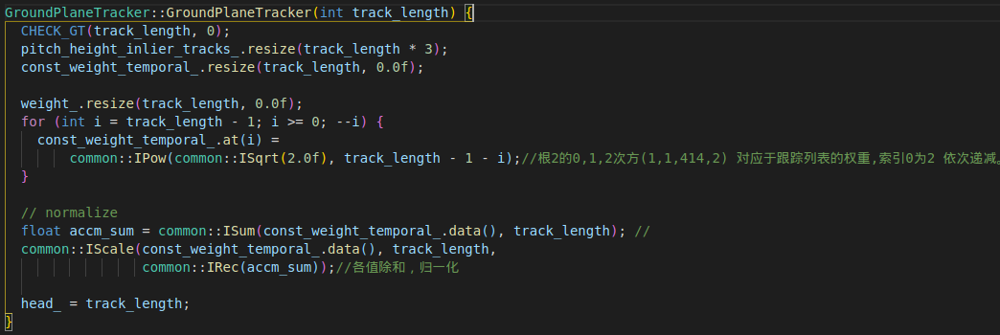

  

--------


> 在机器人领域中，平面检测有多种方法，例如：
>
> Plane segment finder:algorithm, implementation and applications[C].中采用了霍夫变换方法；
> Learning compact 3D models of indoor and outdoor environments with a mobile robot中通过随机选择3D点，并在其周围区域增长的方式查找最大点集拟合平面参数；
> Automatic 3D building reconstruction using plane-roof structures中通过随机一致性采样方法找到局部多边形并合并。

**基于RANSAC随机一致性采样的鲁棒方法**

通过ransac算法不断的对平面方程参数进行估算，先介绍一下RANSAC算法:

RANSAC通过反复选取数据中的一组随机子集来达成目标，被选取的子集被假设为局内点，并通过下属方法进行验证：
	(1) 有一个模型适用于假设的局内点，及所有未知参数都能从假设的局内点中计算得出（**拟合模型**）
	(2) 用（1）中得到的模型去测试其他的数据，如果某个点适用于估计的模型(距离小于阈值)，认为它也是局内点。
	(3) 如果有足够多的点被归类为假设的局内点，则估计的模型就足够合理。
	(4) 然后，用所有假设的局内点重新估计模型，因为它仅仅被初始的假设局内点估计过。
	(5) 最后根据估计局内点与模型的错误率来评估模型。

这个过程重复执行固定次数，每次产生的模型要么因为局内点太少而被舍弃，要么因为它比现有的模型更好而被采用。

相比于最小二乘采用了所有点，RANSAC仅采用局内点进行模型的计算，局外点并不影响模型效果。

对于平面的拟合基本步骤如下:
	(1) 随机取样：随机抽取数据作为样本
	(2) 拟合模型：根据样本获取模型参数M
	(3) 判断距离: 判断所有数据点到模型的距离，将距离小于阈值的加入局内点，记录此时模型的局内点数
	(4) 判断：局内点数目>阈值，则利用此时的局内点重新估计模型，重复3-5次，将得到的局内点数最多的模型即为当前					的最佳模型；局内点数目<阈值,   则跳出
	(5) 跳到步骤(1)，循环N次

-----

### 2. 移除异常的移动

 首先根据其位置信息，移除异常移动的target，并将这些target的最新检测目标创建新的target,同时更新这些新创建的target的2D和类型信息(通过相应的滤波器更新当前状态)

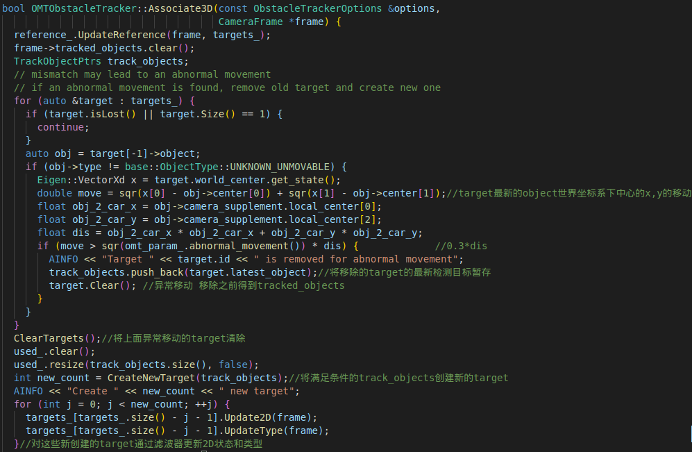

然后对target进行三维信息更新(target.Update3D),更新的状态有:

> FirstOrderRCLowPassFilter direction
>
> MeanFilter world_center_for_unmovable;
>
> KalmanFilterConstVelocity world_center;
>
> KalmanFilterConstState<2> world_center_const; // constant position kalman state
>
> MeanFilter world_velocity;
>
> MeanFilter displacement_theta;//位移方向

主要处理得到了`速度、位置和朝向`

## 