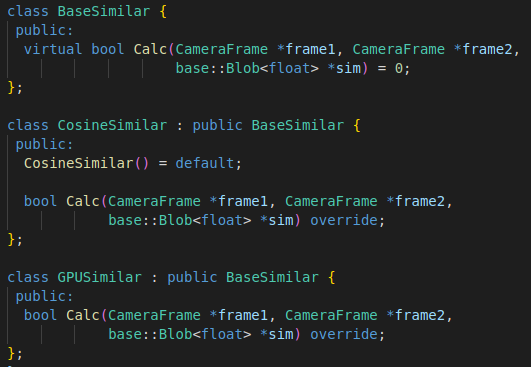
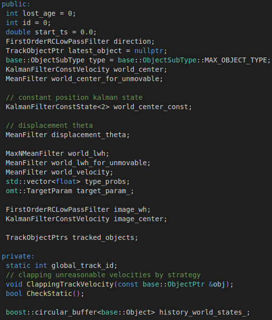
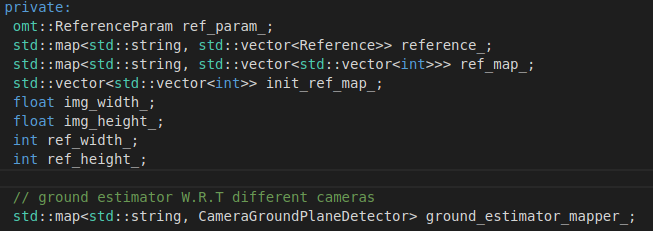
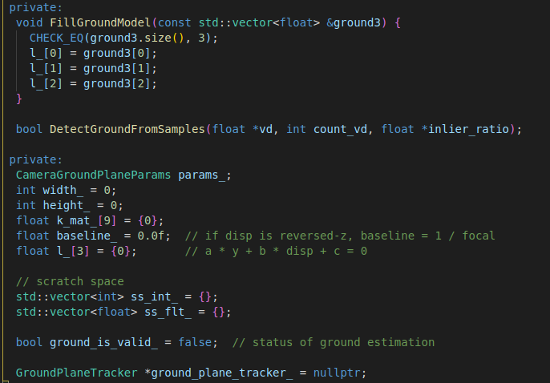
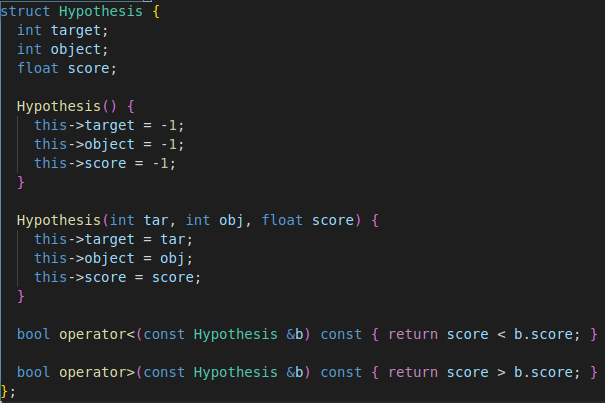

---

title: Apollo 中的检测算法
categories:
- Apollo
tags:
- track
mathjax: ture
---

Apollo中的检测算法

<!--more-->

跟踪的基本成员单位为封装object类为TrackObject类，最后`Target`类结构中包含`TrackObject`类及相关的估计方法。

## tracker_->Predict(frame):预测部分

在新图像中预测候选障碍物 将输出赋值给frame->proposed_objects

## extractor_->Extract(frame):特征提取部分

对每个检测到的对象进行特征提取

```c++
struct FeatureExtractorLayer {
  std::shared_ptr<inference::Layer<float>> pooling_layer;
  std::shared_ptr<base::Blob<float>> rois_blob;
  std::shared_ptr<base::Blob<float>> top_blob;
};
```

```c++
   feature_extractor_layer_ptr->pooling_layer->ForwardGPU(
        {feat_blob_, feature_extractor_layer_ptr->rois_blob},
        {frame->track_feature_blob});
```

其中`feat_blob_`的现行定义是:

```protobuf
feat_stride: 32
extractor {
  feat_blob: "conv4_3"
  feat_type: ROIPooling
  roi_pooling_param {
      pooled_h: 3
      pooled_w: 3
      use_floor: true
  }
}
```

这样根据feat_blob_以及rois_blob(由bbox位置确定)进行`ROIPooling`将最终pool得到的最大值存到track_feature_blob中。

## tracker_->Associate2D(frame):根据2D信息关联

### 该部分的主要成员变量

1. 成员类帧列表:`FrameList` 包装了`CameraFrame`类

   ```c++
     int frame_count_ = 0; //添加帧的数量
     int capability_ = 0;	//容量(14)表示14帧后开始覆盖
     std::vector<CameraFrame *> frames_;
   ```

2. 相似性map:`SimilarMap` 存储blob的嵌套vector

   ```c++
     std::vector<std::vector<std::shared_ptr<base::Blob<float>>>> map_sim;
     int dim;//=omt_param_.img_capability()=14
   ```

3. 相似性计算`BaseSimilar`  `std::shared_ptr<BaseSimilar> similar_`



​	其中GPUSimilar用到了BLAS(线性代数)库:https://blog.csdn.net/cocoonyang/article/details/58602654?depth_1-utm_source=distribute.pc_relevant.none-task&utm_source=distribute.pc_relevant.none-task

4. `Target`类包含了跟踪物体的id和相关的状态信息,`tracked_objects`包含了被跟踪的物体vector,是`TrackObject`类
   `Target`类为期望得到检测框匹配的跟踪物体

   

5. `TrackObject`类则封装了跟踪目标`Object`类，记录该跟踪目标对应的帧id和传感器名称,是跟踪目标的最小封装单位

   ```c++
   struct TrackObject {
     PatchIndicator indicator; //保存了传感器的名称和目标在帧中的id
     double timestamp;
     base::BBox2DF projected_box;//由检测得到的原2dbox　经projected_matrix投影得到的bbox 这个矩阵是啥意思不太清楚 narrow to obstacle projected_matrix
     base::ObjectPtr object;
   };
   ```

6. `PatchIndicator`类主要包含了两个变量,重载运算符"=="为frame_id和patch_id分别相等

   ```c++
     int frame_id;//为该检测目标对应的是第几帧(frame id )
     int patch_id;//该检测目标在该帧中的id(object id)
     std::string sensor_name;//记录检测到的传感器名称
   ```

7. `ObstacleReference`类包含了与模板相关的参数：

   

8. `reference`类

   ```c++
   struct Reference {
     float area = 0.0f;
     float k = 0.0f;
     float ymax = 0.0f;
   };
   ```

9. `CameraGroundPlaneDetector`类，地平面检测的相关方法

   

### 2D关联算法的实现

1. 计算各帧与当前帧的余弦相似性:
2. 从已跟踪物体列表中去除最早帧之前的帧中检测到的目标
3. 根据当前帧的检测物体，得到当前的检测跟踪列表

  ```c++
  for(...){
      ...
  	ProjectBox(frame->detected_objects[i]->camera_supplement.box,
                 frame->project_matrix, &(track_ptr->projected_box));
  	track_objects.push_back(track_ptr);
  }
  ```

4. 校正当前帧检测目标的三维尺寸

	```c++
	reference_.CorrectSize(frame); //这个函数挺长的，还没细看明天看
	```

5. 生成假设

   ```c++
   // @brief: 评估新检测目标与targets的相似性
   // @param [in]: track_objects :该帧检测器新检测到的目标
   // @param [in/out]: 
   // 
   GenerateHypothesis(track_objects);
   ```

   其中对应的主要成员变量类型`Hypothesis`的定义为:

   

   

   

6. 创建新目标

   ```c++
   int new_count = CreateNewTarget(track_objects);
   ```

   


## tracker_->Associate3D(frame):根据3D信息关联


## tracker_->Track(frame):跟踪算法