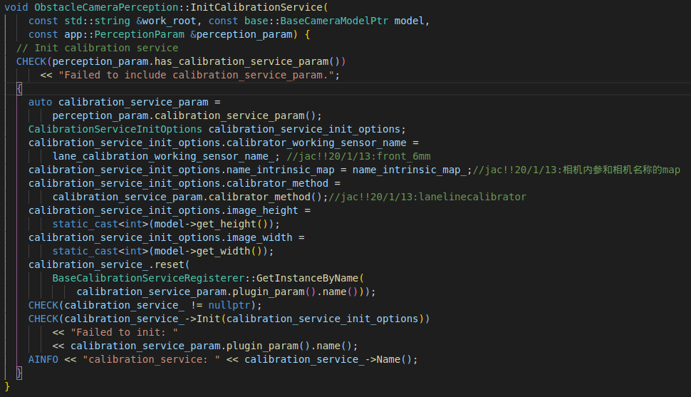

Apollo中的在线标定：用于获取实时外参(针对由于路面颠簸等情况造成相机位姿改变的校正)

<!-- more -->

## Calibration_service

### 1. 初始化

**配置文件与配置信息**

```protobuf
calibration_service_param {
  plugin_param {
      name : "OnlineCalibrationService"
      root_dir : ""
      config_file : ""
  }
  calibrator_method : "LaneLineCalibrator"
}
```



`modules/perception/camera/lib/calibration_service/online_calibration_service/online_calibration_service.cc`


其中相机状态(camera_status)主要包含以下信息：

```c++
struct CameraStatus {
  float camera_ground_height = -1.f;
  float pitch_angle = 0.f;
  float pitch_angle_diff = 0.f;
  std::vector<double> k_matrix = {0.0, 0.0, 0.0, 0.0, 0.0, 0.0, 0.0, 0.0, 0.0};
  std::vector<double> ground_plane = {0.0, 0.0, 0.0, 0.0};
};
```

**LaneLineCalibrator主要初始化过程**：


**LaneBasedCalibator初始化**：


**HistogramEstimator初始化**：(这个地方是直方图密度估计吗？存疑)


---

## 参考文章

> [1]崔洪柳. 基于车道线检测的车载摄像机在线标定算法[D].东北大学,2015.


### 单应性矩阵


### 相机畸变校正　Brown模型

在摄影测量和计算机视觉中都需要对含有畸变的影像进行改正操作，常用到的模型是对透视影像改正的Brown模型