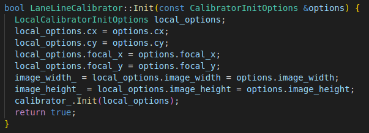
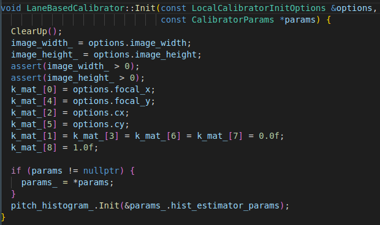
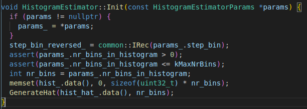

Apollo中的在线标定：用于获取实时外参(针对由于路面颠簸等情况造成相机位姿改变的校正)，由于在线标定算法用到车道线信息，因此此处将车道线检测的相关算法一并说明。

<!-- more -->

## LaneDetector

算法接口文件:`modules/perception/camera/lib/interface/base_lane_detector.h`
该算法实现从图像中检测车道线。

```c++
  // @brief: detect lane from image.
  // @param [in]: options
  // @param [in/out]: frame
  // detected lanes should be filled, required,
  // 3D information of lane can be filled, optional.
  virtual bool Detect(const LaneDetectorOptions& options,
                      CameraFrame* frame) = 0;
```

### 1.初始化

**配置文件信息**：

```c++
lane_param {
  lane_detector_param {
    plugin_param {
      name : "DarkSCNNLaneDetector"
      root_dir : "/apollo/modules/perception/production/data/perception/camera/models/lane_detector/"
      config_file : "config_darkSCNN.pt"
    }
    camera_name : "front_6mm"
  }
  lane_postprocessor_param {
    name : "DarkSCNNLanePostprocessor"
    root_dir : "/apollo/modules/perception/production/data/perception/camera/models/lane_postprocessor/darkSCNN/"
    config_file : "config.pt"
  }
}
```

**初始化程序**：
`ObstacleCameraPerception::Init()`中执行`InitLane()`进行初始化

```c++
// @brief: 车道线检测初始化
// @param [in]: work_root:当前工作路径，通过`GetCyberWorkRoot()`可以获取
// @param [in]: model:相机传感器模型，通过SensorManage类加载`perception_gflags.cc`中的对应文件获取
// @param [in]: perception_param_:上面参数配置文件的相关信息
void InitLane(const std::string &work_root,
                const base::BaseCameraModelPtr model,
                const app::PerceptionParam &perception_param);
```

车道线的初始化包括两大部分，一是检测器detector初始化，二是后处理其postprocessor初始化。

**检测器detector初始化**
由于车道线检测这里用到了网络模型，因此detector初始化过程主要加载了模型的配置文件，以及具体的功能实现类
`DarkSCNNLaneDetector`,然后同障碍物检测的detector相似 进行`DarkSCNNLaneDetector`的初始化:
需要注意的是，`LaneDetector`的实现在`camera/lib/lane/detector/darkSCNN`,
而检测器参数配置则位于`production/data/perception/camera/models/lane_detector`下。

> model_name -> darkSCNN
> proto_flie -> deploy.prototxt
> weight_file -> deploy.caffemodel

网络的输入输出节点名称

> input_blob : "data"
> vpt_blob : "fc_out" //消失点检测
> seg_blob : "softmax" //分割输出

根据上述参数创建网络的推断模型`CreateInferenceByName`，此处`cnnadapter_lane_`的推断模型为`caffe`,然后对此推断模型进行初始化，之前的创建过程并未将参数加载到`caffe`模型中，因此`cnnadapter_lane_->Init`将网络模型结构和网络参数导入到Caffe中。

**后处理器postprocessor初始化**

```c++
lane_map_width: 640
lane_map_height: 480
roi_height: 768
roi_start: 312
roi_width: 1920
```

后处理器实现类`DarkSCNNLanePostprocessor`,该功能类的初始化加载上面所示参数，同时也加载了`detector`的部分参数(图像裁剪相关)

### 2. 算法实现

算法实现的相关过程位于`obstacle_camera_perception.cc`中的`Perception`函数中,并注意车道线检测算法只工作于
`front_6mm`相机上,算法流程如下,然后分模块进行说明。

```c++
//Detect -> Process2D(postprocessor) -> Update(Calibration) -> Process3D(postprocessor)
```

#### 2.1 Detect


----

## Calibration_service

算法接口文件`modules/perception/camera/lib/interface/base_calibration_service.h`

```c++
// @brief query camera to world pose with refinement if any
  virtual bool QueryCameraToWorldPose(Eigen::Matrix4d *pose) const {
    return false;
  }

  // @brief query depth on ground plane given pixel coordinate
  virtual bool QueryDepthOnGroundPlane(int x, int y, double *depth) const {
    return false;
  }

  // @brief query 3d point on ground plane given pixel coordinate
  virtual bool QueryPoint3dOnGroundPlane(int x, int y,
                                         Eigen::Vector3d *point3d) const {
    return false;
  }

  // @brief query ground plane in camera frame, parameterized as
  // [n^T, d] with n^T*x+d=0   ax+by+cz+d=0,法向量 n=(a,b,c)
  virtual bool QueryGroundPlaneInCameraFrame(
      Eigen::Vector4d *plane_param) const {
    return false;
  }

  // @brief query camera to ground height and pitch angle
  virtual bool QueryCameraToGroundHeightAndPitchAngle(float *height,
                                                      float *pitch) const {
    return false;
  }

  virtual float QueryCameraToGroundHeight() const { return 0.f; }

  virtual float QueryPitchAngle() const { return 0.f; }

  // @brief using calibrator to update pitch angle
  virtual void Update(CameraFrame *frame) {
    // do nothing
  }

  // @brief set camera height, pitch and project matrix
  virtual void SetCameraHeightAndPitch(
      const std::map<std::string, float> &name_camera_ground_height_map,
      const std::map<std::string, float> &name_camera_pitch_angle_diff_map,
      const float &pitch_angle_master_sensor) {
    // do nothing
  }

```

`OnCalibrationService`通过车道线进行在线标定，标定参数主要包含了相机的高度和pitch角度。

### 1. 初始化

**配置文件与配置信息**
 `modules/perception/production/conf/perception/camera/obstacle.pt`

```protobuf
calibration_service_param {
  plugin_param {
      name : "OnlineCalibrationService"
      root_dir : ""
      config_file : ""
  }
  calibrator_method : "LaneLineCalibrator"
}
```

```c++
struct CalibrationServiceInitOptions : public BaseInitOptions {
  int image_width = 0;
  int image_height = 0;
  double timestamp = 0;
  std::string calibrator_working_sensor_name = "";
  std::string calibrator_method = "";
  std::map<std::string, Eigen::Matrix3f> name_intrinsic_map;
};
```

**初始化程序**：
在`ObstacleCameraPerception::Init()`中进行初始化`InitCalibrationService`
初始化过程配置在线标定的传感器为`front_6mm`,配置标定方法为:`LaneLineCalibrator`,同时加载内参矩阵和图像宽高,根据`plugin_param`中的`name`确定`calibration_service_`指向的算法实现类为`OnlineCalibrationService`。

### 2. 算法实现

首先，通过`GetCalibrationServcie()`将初始化的标定方法`LaneLineCalibrator`添加到`CameraFrame`数据帧结构中的`calibration_service`中。

`modules/perception/camera/lib/calibration_service/online_calibration_service/online_calibration_service.cc`


其中相机状态(camera_status)主要包含以下信息：

```c++
struct CameraStatus {
  float camera_ground_height = -1.f;
  float pitch_angle = 0.f;
  float pitch_angle_diff = 0.f;
  std::vector<double> k_matrix = {0.0, 0.0, 0.0, 0.0, 0.0, 0.0, 0.0, 0.0, 0.0};
  std::vector<double> ground_plane = {0.0, 0.0, 0.0, 0.0};
};
```

**LaneLineCalibrator主要初始化过程**：



**LaneBasedCalibator初始化**：



**HistogramEstimator初始化**：(这个地方是直方图密度估计吗？存疑)




---

## 参考文章

> [1]崔洪柳. 基于车道线检测的车载摄像机在线标定算法[D].东北大学,2015.


### 单应性矩阵


### 相机畸变校正　Brown模型

在摄影测量和计算机视觉中都需要对含有畸变的影像进行改正操作，常用到的模型是对透视影像改正的Brown模型