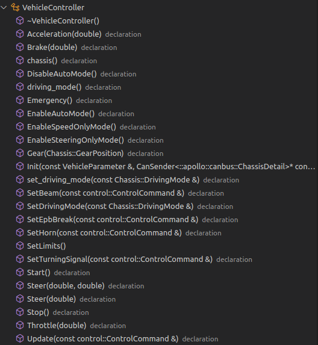
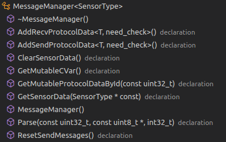
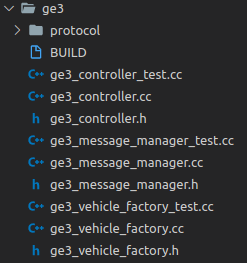

apollo开源框架中can卡的配置
<!--more-->

[TOC]

### 1. 前置内容

本文主要参考：https://zhuanlan.zhihu.com/p/61838008

Apollo 在车辆的信息交互和车辆配置上均使用了`Protobuf` 

> Protocol Buffers 是一种轻便高效的结构化数据存储格式，可以用于结构化数据串行化，或者说序列化。它很适合做数据存储或 RPC 数据交换格式。可用于通讯协议、数据存储等领域的语言无关、平台无关、可扩展的序列化结构数据格式。目前提供了 C++、Java、Python 三种语言的 API。[[1]][1]

通常车企采用DBC文件完成CAN信号的定义和解析,由于Apollo中采用了Protobuf进行模块间的通信和配置，因此车企需要使用Apollo提供的工具基于DBC生成Apollo可用的proto文件。

> DBC文件是用来描述CAN网络通信信号的一种格式文件。

一般各车厂DBC文件的定义不同并严格保密，为了解决无人驾驶系统中与车辆交互的问题，Apollo搭建了《开放汽车认证平台》，由此，方便无人驾驶的车辆部署，`ApolloAuto/apollo/tree/master/modules/canbus/vehicle` 中有目前支持的参考车辆目录。新增车辆需要新建一个目录以及对应的文件，通过工具可基于DBC文件快速生成Apollo参考车辆适配层模板， <span id="jump">工具</span>位于`ApolloAuto/apollo/tree/master/modules/tools/gen_vehicle_protocol` 下，使用方法参考`readme`。[[3]][3]

> 该平台作为软硬件中间层，提出了开放车辆接口标准，定义了系统与车辆的线控接口，负责完成系统与汽车的具体交互，同时该平台抽象出了与车型无关的信号作为上层算法模块的输入，使得上层平台可以与底层车辆解耦。
>
> 具体线控需求规范可参考：https://link.zhihu.com/?target=http%3A//apollo-homepage.bj.bcebos.com/Apollo_by_wire_requirement.xlsx


### 2. Apollo Cancard参数配置文件

#### 2.1 apollo 中采用proto文件管理相关配置
apollo 激活车辆的配置文件的相关路径为`modules/canbus/conf/canbusconf.pb.txt`, 可在该文件中定义**车型**及对应的CAN card参数.

- apollo 中相关算法默认车辆是Lincoln MKZ ,如何置换或添加新的车辆到Apollo中可参考文档：`apollo/docs/howto/hwo_to_add_a_new_vehicle.md` <span id="newvehicle">  </span> 

> - Implement the new vehicle controller :`class NewVehicleController final : public VehicleController{...}`
> - Implement the new message manager：`class NewVehicleMessageManager : public MessageManager {...}`
> - Implement the new vehicle factory:`class NewVehicleFactory : public AbstractVehicleFactory {...}`
> - Register the New Vehicle:`void VehicleFactory::RegisterVehicleFactory(){...}`
> - Update the configuration file: `vehicle_parameter{...}` 这就是下面要描述的。


```protobuf
vehicle_parameter {
  brand: LINCOLN_MKZ //车型 该参数决定了车辆的相关标定参数
  max_enable_fail_attempt: 5 
  driving_mode: COMPLETE_AUTO_DRIVE
}

can_card_parameter {
  brand: ESD_CAN //CAN卡通信方式，还有比如socket类型
  type: PCI_CARD //Can卡类型，还有比如USB_CARD
  channel_id: CHANNEL_ID_ZERO 
}

enable_debug_mode: false
enable_receiver_log: false
enable_sender_log: false
```

上述参数配置文件的参数含义由下面的`proto` 文件决定：

- `modules/canbus/proto/canbus_conf.proto`

```protobuf
syntax = "proto2";

package apollo.canbus;

import "modules/drivers/canbus/proto/can_card_parameter.proto";
import "modules/canbus/proto/vehicle_parameter.proto";

message CanbusConf {
  optional VehicleParameter vehicle_parameter = 1;
  optional apollo.drivers.canbus.CANCardParameter can_card_parameter = 2;
  optional bool enable_debug_mode = 3 [default = false];
  optional bool enable_receiver_log = 4 [default = false];
  optional bool enable_sender_log = 5 [default = false];
}
```

------------------------

- `modules/canbus/proto/vehicle_parameter.proto`

  该文件中定义了车辆的相关参数

```protobuf
syntax = "proto2";

package apollo.canbus;

import "modules/canbus/proto/chassis.proto";
import "modules/common/configs/proto/vehicle_config.proto";

message VehicleParameter {
  optional apollo.common.VehicleBrand brand = 1;
  optional double max_engine_pedal = 2;
  optional int32 max_enable_fail_attempt = 3;
  optional Chassis.DrivingMode driving_mode = 4;
}
```

详细各文件内容此处略去不表，`VehicleBrand` 表示apollo支持的车辆品牌,目前有`LINCOLN_MKZ、GEM、LEXUS、TRANSIT、GE3、WEY、ZHONGYUN、CH` 

------------------

- `modules/drivers/canbus/proto/can_card_parameter.proto`

  该文件中定义了cancard的三个相关参数定义

```protobuf
syntax = "proto2";

package apollo.drivers.canbus;

message CANCardParameter {
  enum CANCardBrand {
    FAKE_CAN = 0;
    ESD_CAN = 1;
    SOCKET_CAN_RAW = 2;
    HERMES_CAN = 3;
  }

  enum CANCardType {
    PCI_CARD = 0;
    USB_CARD = 1;
  }

  enum CANChannelId {
    CHANNEL_ID_ZERO = 0;
    CHANNEL_ID_ONE = 1;
    CHANNEL_ID_TWO = 2;
    CHANNEL_ID_THREE = 3;
  }

  optional CANCardBrand brand = 1;
  optional CANCardType type = 2;
  optional CANChannelId channel_id = 3;
}
```

------------

#### 2.2 信号交互

通常车企采用DBC文件完成CAN信号的定义和解析，Apollo则大量使用了Protobuf来进行模块间的通信和配置，因此车企需要通过Apollo提供的[工具](#jump)基于DBC来生成Apollo可用`Proto`文件：以<u>广汽传祺GE3 开发者版</u> 为例

`modules/canbus/proto/ge3.proto`

```protobuf
syntax = "proto2";

package apollo.canbus;
...
message Ge3 {
  optional Pc_bcm_201 pc_bcm_201 = 1; // control message
  optional Scu_bcs_3_308 scu_bcs_3_308 = 2; // report message
  optional Pc_epb_203 pc_epb_203 = 3; // control message
  optional Pc_bcs_202 pc_bcs_202 = 4; // control message
  optional Pc_vcu_205 pc_vcu_205 = 5; // control message
  optional Pc_eps_204 pc_eps_204 = 6; // control message
  optional Scu_vcu_2_313 scu_vcu_2_313 = 7; // report message
  optional Scu_1_301 scu_1_301 = 8; // report message
  optional Scu_2_302 scu_2_302 = 9; // report message
  optional Scu_3_303 scu_3_303 = 10; // report message
  optional Scu_bcm_304 scu_bcm_304 = 11; // report message
  optional Scu_bcs_1_306 scu_bcs_1_306 = 12; // report message
  optional Scu_bcs_2_307 scu_bcs_2_307 = 13; // report message
  optional Scu_epb_310 scu_epb_310 = 14; // report message
  optional Scu_vcu_1_312 scu_vcu_1_312 = 15; // report message
  optional Scu_eps_311 scu_eps_311 = 16; // report message
}
```

#### 2.3 车辆配置

Protobuf 提供了名为`TextFormat` 的序列化格式（该格式可读性强，类似于Json），配合事先定义的Proto文件，开发者可以轻易实现从可读的配置文件到具体对象的实力的反射，配置文件经过反序列化后可以作为业务代码类的输入，这种方式使得配置更加便捷，具有很好的向后兼容性。

Apollo 中大量采用了这种方式管理配置，Apollo激活车辆的配置文件为`modules/canbus/conf/canbus_conf.pb.txt` ,开发者可以再次定义车型以及对应的CAN card的参数，例如只需修改`vehicle_parameter` 相对应的字段，即可使Apollo支持相应的车型。

-----

### 3 代码实现

#### 3.1 Canbus模块

软件实现上，Apollo通过`CANBus` 模块来实现对车辆的管理和通讯。

`CANBus` 模块接收并执行来自Contorl模块的指令，同时收集汽车底盘的状态（由Apollo抽象出的一组与车型无关的信号）。`CANBus` 模块处理这些状态与各个汽车底盘信号的映射关系，随后将这些状态反馈回`Control`模块，以此兼容不容车型。 


`modules/canbus/proto/chassis.proto` 对Apollo抽象出的信号进行了定义，大体包括以下信息：

> DrivingMode: COMPLETE_MANUAL、COMPLETE_AUTO_DRIVE 、...
>
> ErrorCode(错误码): 控制指令周期不准、底盘转向错误、人工接管
>
> GearPosition(档位): 前进、后退、驻停等
>
> 底盘信息：车速、转速、油门、里程计
>
> Gps
>
> 轮速

`CANBus` 模块主要由以下两个部件组成：

> Vehicle: the vehicle itself,including its controller and message manager
>
> CAN  Client: CAN client has been moved to `/modules/drivers/canbus` since it is shared by different sensors utilizing the canbus protocol [[4]][4]

针对`Vehicle`部分进行着重介绍：
- `Vehicle`的Controller（`modules/cnabus/vehicle/vehicle_controller.h`）类图如下（简化）:

  

`Vehicle Controller` 类负责完成与汽车底盘的具体交互，以下为部分接口说明：

```c++
  /**
   * @brief start the vehicle controller. 注：干函数会在内部起一个名为”SecurityDogThread-Func“ 的线程
   * 该线程会周期性检查与底盘的通讯状况，关键信号是否相应，是否有错误等
   * @return true if successfully started.
   */
  virtual bool Start() = 0;

  /**
   * @brief stop the vehicle controller.
   */
  virtual void Stop() = 0;

  /**
   * @brief calculate and return the chassis.
   * 注：该函数完成了汽车底盘信号和Apollo内部定义的底盘状态信号的映射
   * @returns a copy of chassis. Use copy here to avoid multi-thread issues.
   */
  virtual Chassis chassis() = 0;

  /**
   * @brief update the vehicle controller.
   * 该函数用于执行来自Control模块的具体指令，根据指令要求和汽车目前所处的模式(完全自动、完全手动等)来为执行器的信号(档位、油门、转向)进行赋值
   * @param command the control command
   * @return error_code
   */
  virtual common::ErrorCode Update(const control::ControlCommand &command);
```

- Vehicle的`MessageManger`类负责完成具体对信号的接收、发送、解析等。

  其类图`modules/drivers/canbus/can_common/message_manager.h`如下

  

  ```c++
  //用于指定系统接收的信号
  template <typename SensorType>
  template <class T, bool need_check>
  void MessageManager<SensorType>::AddRecvProtocolData() {...}
  
  //用于指定系统向汽车底盘发送的控制信号
  template <typename SensorType>
  template <class T, bool need_check>
  void MessageManager<SensorType>::AddSendProtocolData() {...}
  ```

  - 以`ge3` 车型为例，`ge3` 文件夹下包含如下文件：

    

    根据Apollo的官方文件`how_to_add_a_new_vehicle` 想为Apollo添加`ge3` 车型需要完成以下[内容](#newvehicle)：

    > - 实现新的车辆控制器--`ge3_controller.cc`,继承`VehicleController` 类
    >
    > - 实现新的消息管理器-- ge3_message_manager.cc ,继承`MessageManager` 类
    >
    > - 实现新的车辆工厂类 -- ge3_vehicle_factory.cc ,继承`AbstractVehicleFactory` 类
    >
    > - 更新配置文件
    >
    >   - 在`modules/canbus/vehicle/vehicle_factory.cc` 中进行注册
    >
    >     ```c++
    >      Register(apollo::common::GE3, []() -> AbstractVehicleFactory * {
    >         return new Ge3VehicleFactory();
    >       });
    >     ```
    >
    >   - 更新配置文件`modules/canbus/conf/canbus_conf.pb.txt`
    >
    > 

#### 3.2 CANBus工厂模式

通过上述方法能够增加新车型的原因在于Apollo的配置基于`工厂模型` （参见另一篇文章）实现的。

> 工厂方法模式（Factory method pattern）是一种实现了“工厂”概念的`面向对象设计模式` 。就像其他`创建型模式`一样，它也是处理在不指定`对象`具体类型的情况下创建对象的问题。工厂方法模式的实质是“定义一个创建对象的接口，但让实现这个接口的类来决定实例化哪个`类` ”。工厂方法让类的实例化推迟到子类中进行。[[5]][5]

CANBus模块中Vehicle相关的内容使用工厂模式抽象出了`VehicleController`,`MessageManager`,`AbstractVehicleFactory` 三个接口。CANBus的**业务**代码(`canbus_component.cc`) 通过以上接口来操纵具体的对象，用户无需关心具体的对象是什么，从而实现了业务逻辑和目标对象的解耦。

 

在Canbus模块中，工厂类为"VehicleFactory",继承于工厂模板"Factory"。"VehicleFactory"工厂维护了键值对为“VehicleParameter::VechileBrand”和"AbstractVehicleFactory"的Map。


如下所示，每新注册注册一种车型，该Map中就会插入一条汽车品牌(VehicleBrand)和该品牌汽车生产工厂(AbstractVehicleFactory)的键值对。(ProductCreator 采用Lambda 表达式)

```c++
void VehicleFactory::RegisterVehicleFactory() {
  Register(apollo::common::LINCOLN_MKZ, []() -> AbstractVehicleFactory * {
    return new LincolnVehicleFactory();
  });
  Register(apollo::common::GEM, []() -> AbstractVehicleFactory * {
    return new GemVehicleFactory();
  });
  Register(apollo::common::LEXUS, []() -> AbstractVehicleFactory * {
    return new LexusVehicleFactory();
  });
  Register(apollo::common::TRANSIT, []() -> AbstractVehicleFactory * {
    return new TransitVehicleFactory();
  });
  Register(apollo::common::GE3, []() -> AbstractVehicleFactory * {
    return new Ge3VehicleFactory();
  });
  Register(apollo::common::WEY, []() -> AbstractVehicleFactory * {
    return new WeyVehicleFactory();
  });
  Register(apollo::common::ZHONGYUN, []() -> AbstractVehicleFactory * {
    return new ZhongyunVehicleFactory();
  });
  Register(apollo::common::CH,
           []() -> AbstractVehicleFactory * { return new ChVehicleFactory(); });
}
```

当VehicleFactory类的`CreateVehicle`方法被调用时，"VehicleFactory"会根据输入的汽车品牌，在Map中查找并返回可以生产这种汽车的工厂。


例如输入汽车品牌为`GE3` ，"VehicleFactory"会返回`Ge3VehicleFactory` ,`Ge3VehicleFactory`继承于`AbstractVehicleFactory` 。


```c++
  /**
   * @brief Creates an AbstractVehicleFactory object based on vehicle_parameter
   * @param vehicle_parameter is defined in vehicle_parameter.proto
   */
  std::unique_ptr<AbstractVehicleFactory> CreateVehicle(
      const VehicleParameter &vehicle_parameter);
```

`AbstractVehicleFactory` 工厂会产出一组适用于该品牌车型的产品即`MessageManager`和`Vehiclecontroller`

`modules/canbus/vehicle/ge3/ge3_vehicle_factory.h`

```c++
std::unique_ptr<VehicleController>
Ge3VehicleFactory::CreateVehicleController() {
  return std::unique_ptr<VehicleController>(new ge3::Ge3Controller());
}

std::unique_ptr<MessageManager<::apollo::canbus::ChassisDetail>>
Ge3VehicleFactory::CreateMessageManager() {
  return std::unique_ptr<MessageManager<::apollo::canbus::ChassisDetail>>(
      new ge3::Ge3MessageManager());
}
```

`Ge3VehicleFactory` 最终会生产处一组适用于该品牌车型的产品，即`VehicleController` 和 `MessageManager`

### 4.Canbus组件

​	最后介绍CANBus模块的CanbusComponent，该类继承于`apollo::cyber::TimerComponent` ，主要作用是处理来自控制模块的控制指令，并将信号消息发送至CAN card。

​	CanbusComponent 的初始化函数（Init）主要完成以下工作：

 1. 读取Canbus配置文件

    `modules/canbus/conf/canbusconf.pb.txt`

    `modules/canbus/proto/canbus_conf.proto`

    ```c++
      if (!GetProtoConfig(&canbus_conf_)) {
        AERROR << "Unable to load canbus conf file: " << ConfigFilePath();
        return false;
      }
    ```

 2. 根据配置文件初始化`Can-client`

    ```c++
    can_client_ = can_factory->CreateCANClient(canbus_conf_.can_card_parameter());
    ```

 3. 根据配置文件获取汽车工厂

    ```c++
    VehicleFactory vehicle_factory;
      vehicle_factory.RegisterVehicleFactory();
      auto vehicle_object =
          vehicle_factory.CreateVehicle(canbus_conf_.vehicle_parameter());
    ```

 4. 获取该汽车工厂生产的`message_manager` 和 `Vehicle_controller`

    ```c++
    message_manager_ = vehicle_object->CreateMessageManager();
    if (can_receiver_.Init(can_client_.get(), message_manager_.get(),
                             canbus_conf_.enable_receiver_log()) != ErrorCode::OK) {...}
    if (can_sender_.Init(can_client_.get(), canbus_conf_.enable_sender_log()) !=
          ErrorCode::OK) {...}
    vehicle_controller_ = vehicle_object->CreateVehicleController();
    ...
    ```

 5. 使能Can收发和`Vehicle_controller`

    初始化完成后，`CanbusComponent` 会周期性的报告车身状态，并执行来自`Control` 模块和`Guardian`模块的指令。

    ```c++
    bool CanbusComponent::Proc() {
      PublishChassis();
      if (FLAGS_enable_chassis_detail_pub) {
        PublishChassisDetail();
      }
      return true;
    } //周期性执行
    
    
    //事件触发，Reader回调函数
    void CanbusComponent::OnControlCommand(const ControlCommand &control_command) {/*...*/}
    
    void CanbusComponent::OnGuardianCommand(
        const GuardianCommand &guardian_command) {
      apollo::control::ControlCommand control_command;
      control_command.CopyFrom(guardian_command.control_command());
      OnControlCommand(control_command);
    }
    
    
    ```

    


### 参考链接

> [1]   https://www.ibm.com/developerworks/cn/linux/l-cn-gpb/index.html protobuf 相关介绍
>
> [2]   https://zhuanlan.zhihu.com/p/61838008 本文主要参考文章
>
> [3]   http://apollo.auto/docs/procedure_cn.html  针对车辆CAN DBC文件如何生成proto文件
>
> [4]   https://github.com/ApolloAuto/apollo/tree/master/modules/canbus  "canbus"
>
> [5]   https://zh.wikipedia.org/wiki/%E5%B7%A5%E5%8E%82%E6%96%B9%E6%B3%95#cite_note-1(https://zh.wikipedia.org/wiki/工厂方法#cite_note-1)   
>
> [6] https://zhuanlan.zhihu.com/p/61838008

> [1]: https://www.ibm.com/developerworks/cn/linux/l-cn-gpb/index.html	"protobuf 相关介绍"
> [2]: https://zhuanlan.zhihu.com/p/61838008	"本文主要参考文章"
> [3]: http://apollo.auto/docs/procedure_cn.html	"针对车辆CAN DBC文件如何生成proto文件"
> [4]: https://github.com/ApolloAuto/apollo/tree/master/modules/canbus	"canbus"
> [5]: https://zh.wikipedia.org/wiki/%E5%B7%A5%E5%8E%82%E6%96%B9%E6%B3%95#cite_note-1(https://zh.wikipedia.org/wiki/工厂方法#cite_note-1)
