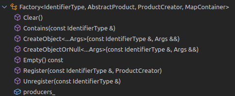

apollo 中工厂模式相关知识介绍
<!-- more -->

[TOC]

本文主要参考：[https://blog.csdn.net/davidhopper/article/details/79197075](https://blog.csdn.net/davidhopper/article/details/79197075)

工厂模式的定义和实现相关资料可参考：

> - [https://zh.wikipedia.org/wiki/%E5%B7%A5%E5%8E%82%E6%96%B9%E6%B3%95](https://zh.wikipedia.org/wiki/工厂方法)
> - 《设计模式：可复用面向对象软件的基础》

### 1. Apollo 对象的创建方式

基本由 栈创建对象、堆创建对象、单例模式创建对象、工厂模式创建对象

Apollo项目中对象的创建，大多使用直接法，例如：

- //在栈(stack)上直接创建对象

  ADCTrajectory not_ready_pb;

- //在堆(heap)上直接创建对象

  ZeroCopyOutputStream *output = new FileOutputStream(file_descriptor);

> 堆和栈的主要区别在于 `生命周期` 和 `性能` 由于栈的特性，栈上的对象不需要手动管理内存，而堆由程序员自行负责何时用delete释放内存，动态内存的生命周期由我们决定更加灵活。

- 还有部分通过`单例模式`创建：`DECLARE_SINGLETON(CanClientFactory)` ,其定义如下：

```c++
#define DECLARE_SINGLETON(classname)                                      \
 public:                                                                  \
  static classname *Instance(bool create_if_needed = true) {              \
    static classname *instance = nullptr;                                 \
    if (!instance && create_if_needed) {                                  \
      static std::once_flag flag;                                         \
      std::call_once(flag,                                                \
                     [&] { instance = new (std::nothrow) classname(); }); \
    }                                                                     \
    return instance;                                                      \
  }                                                                       \
                                                                          \
  static void CleanUp() {                                                 \
    auto instance = Instance(false);                                      \
    if (instance != nullptr) {                                            \
      CallShutdown(instance);                                             \
    }                                                                     \
  }                                                                       \
                                                                          \
 private:                                                                 \
  classname();                                                            \
  DISALLOW_COPY_AND_ASSIGN(classname)

```
​	其中内嵌宏 `DISALLOW_COPY_AND_ASSIGN(classname)`的定义如下：
```c++
#define DISALLOW_COPY_AND_ASSIGN(classname) \
  classname(const classname &) = delete;    \
  classname &operator=(const classname &) = delete;
```
​	因此：`DECLARE_SINGLETON(CanClientFactory)` 展开后的定义为：
```c++
#define DECLARE_SINGLETON(CanClientFactory)                                      \
 public:                                                                  \
  static CanClientFactory *Instance(bool create_if_needed = true) {              \
    static CanClientFactory *instance = nullptr;                                 \
    if (!instance && create_if_needed) {                                  \
      static std::once_flag flag;                                         \
      std::call_once(flag,                                                \
                     [&] { instance = new (std::nothrow) CanClientFactory(); }); \
    }                                                                     \
    return instance;                                                      \
  }                                                                       \
                                                                          \
  static void CleanUp() {                                                 \
    auto instance = Instance(false);                                      \
    if (instance != nullptr) {                                            \
      CallShutdown(instance);                                             \
    }                                                                     \
  }                                                                       \
                                                                          \
 private:                                                                 \
  CanClientFactory();                                                            \
  CanClientFactory(const CanClientFactory &) = delete;    \
  CanClientFactory &operator=(const CanClientFactory &) = delete;

```

​		上述代码的意义，首先定义一个静态公有函数Instance(),该函数在栈上创建一个`CanClientFactory` 类的静态对象，然后返回该对象指针。同时，将`CanClientFactory` 类的默认构造函数、复制（或称拷贝）构造函数、复制赋值运算符（或称操作符）定义为私有（private）函数，即禁止进行隐式类型转换和复制操作。**单例模式保证一个类只有一个实例，并提供一个访问它的全局访问点，即通过静态指针来指向此唯一实例**

> c++中的static关键词可以用于修改局部变量，函数，类的数据成员以及对象。
>
> ​	静态局部变量只初始化一次，然后每次函数调用时保持其值。
>
> ​	静态成员函数可以直接用类来调用，不需要创建实例来调用。
>
> 静态对象：`static Test t1；` 
>
> ​	静态对象只初始化一次，并且在整个程序的生命周期中都存在，静态对象保存在静态存储区，在程序结束时销毁。

- 还有部分对象通过工厂模式创建对象，例如：

  ```c++
  /**
   * @class VehicleFactory
   *
   * @brief This class is a factory class that will generate different
   * vehicle factories based on the vehicle brand.
   */
  class VehicleFactory
      : public common::util::Factory<apollo::common::VehicleBrand,
                                     AbstractVehicleFactory> {
   public:
    /**
     * @brief register supported vehicle factories.
     */
    void RegisterVehicleFactory();
  
    /**
     * @brief Creates an AbstractVehicleFactory object based on vehicle_parameter
     * @param vehicle_parameter is defined in vehicle_parameter.proto
     */
    std::unique_ptr<AbstractVehicleFactory> CreateVehicle(
        const VehicleParameter &vehicle_parameter);
  };
  ```

  关于工厂模式的介绍，可以参考：下面简单介绍
  
  [https://blog.csdn.net/linwh8/article/details/51232834][https://blog.csdn.net/linwh8/article/details/51232834]  
  
  [https://www.runoob.com/design-pattern/abstract-factory-pattern.html][https://www.runoob.com/design-pattern/abstract-factory-pattern.html]

### 2. 浅谈工厂模式


首先`ProductFactory`可以想象为生产某种产品（抽象类产品）的某类工厂（抽象类工厂），此抽象类工厂演变出许多实例化对象，即为实际的工厂（工厂实例化对象）：`ConcreteProductFactoryA,ConcreteProductFactoryB` ,而这两个**实例化工厂**生产的内容与抽象工厂定义的内容一致，即包含一个抽象类product。

然后`Product`某种产品（抽象类产品），它能演变出许多实例化对象:`ConcreteProductA,ConcreteProductB` ,也就是上面的实例化工厂都能生产A、B两种产品。

举个栗子：

现在由生产口罩的工厂（抽象类工厂）：工厂A(工厂实例化对象)，工厂B(工厂实例化对象)。这两个工厂都生产口罩（抽象类产品）：KN95口罩（产品实例化对象）、一次性医用口罩(产品实例化对象)。

### 3.Apollo项目工厂模式分析

​	Apollo采用的是抽象工厂模式，因为该项目使用模板定义工厂类，因此工厂模式经典定义中的抽象工厂类不再需要，Apollo提供了一个工厂模板(`modules/common/util/factory.h`) ,该模板可支持任何类型的输入，类图如下：



> Factory类中包含了`Register()`、`Unregister()` 、`Empty()`、`CreateObjectOrNull()`、`CreateObject()` 等公有函数，其中`Register()` 、`Unregister()`函数用于注册和反注册产品类，其作用与经典模式中抽象工厂接口类的功能类似，`Empty()` 函数用于判断当前工厂类中是否包含产品创建函数，`CreateObjectOrNull()`、`CreateObject()` 函数用于创建可能包含空指针和不包含空指针的产品类对象。

​	Factory工厂模板维护了一个Map用来管理`IdentifierType`和`ProductCreator`的键值对，根据输入的`IdentifierType`,模板可以返回`ProductCreator`生产的产品，从而实现了从`IdentifierType`到`Productde` "映射"

```c++
template <typename IdentifierType, class AbstractProduct,
          class ProductCreator = AbstractProduct *(*)(),
          class MapContainer = std::map<IdentifierType, ProductCreator>>
```

Factory类模板中参数`ProductCreator=AbstractProduct*（*）()` 全部采用简洁的Lambda表达式实现

> lambda 表达式：
>
> 完整格式声明：`[capture list] (params list) mutable exception-> return type { function body }`
>
> capture list:捕获外部变量列表  params list:形参列表 exception:异常设定（一般省略）

Apollo项目中对Factory类实例化的情形包括但不限于：

```c++
class VehicleFactory
    : public common::util::Factory<apollo::common::VehicleBrand,
                                   AbstractVehicleFactory>{/*.../*}
```

```c++
class CanClientFactory
    : public apollo::common::util::Factory<CANCardParameter::CANCardBrand,
                                           CanClient> {/*.../*}
```

```c++
apollo::common::util::Factory<TaskConfig::TaskType, NaviTask> task_factory_;
```

```c++
common::util::Factory<PlannerType, Planner> planner_factory_
```


注册产品类代码为：

```c++
void NaviPlanner::RegisterTasks() {
  task_factory_.Register(TaskConfig::NAVI_PATH_DECIDER,
                         []() -> NaviTask* { return new NaviPathDecider(); });
  task_factory_.Register(TaskConfig::NAVI_SPEED_DECIDER,
                         []() -> NaviTask* { return new NaviSpeedDecider(); });
}
```

代码中的产品创建函数`ProductCreator=AbstractProduct*（*）()` 采用Lambda表达式实现。

创建具体的产品类对象的代码为:

`modules/planning/planner/navi/navi_planner.cc`

```c++
Status NaviPlanner::Init(const PlanningConfig& config) {
  // NaviPlanner is only used in navigation mode based on the real-time relative
  // map.
  if (!FLAGS_use_navigation_mode) {
    std::string msg = "NaviPlanner is only used in navigation mode.";
    AERROR << msg;
    return Status(ErrorCode::PLANNING_ERROR, msg);
  }

  AINFO << "In NaviPlanner::Init()";
  RegisterTasks();
  PlannerNaviConfig planner_conf =
      config.navigation_planning_config().planner_navi_config();
  for (const auto task : planner_conf.task()) {
    tasks_.emplace_back(
        task_factory_.CreateObject(static_cast<TaskConfig::TaskType>(task)));
    AINFO << "Created task:" << tasks_.back()->Name();
  }
  for (auto& task : tasks_) {
    if (!task->Init(config)) {
      std::string msg(
          common::util::StrCat("Init task[", task->Name(), "] failed."));
      AERROR << msg;
      return Status(ErrorCode::PLANNING_ERROR, msg);
    }
  }
  return Status::OK();
}

```

配置文件为：`modules/planning/conf/planning_config_navi.pb.txt`

```c++
planner_type : NAVI
planner_navi_config {
  task : NAVI_PATH_DECIDER
  task : NAVI_SPEED_DECIDER
  //...
```

上述配置文件表明，`NaviPlanner`类动态生成了`NAVI_PATH_DECIDER` 、`NAVI_SPEED_DECIDER` 任务对象。

