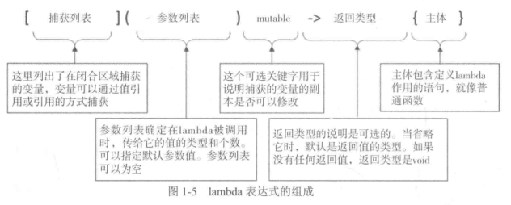

---

title: 序列容器
categories:
- c++
- STL
tags:
- c++
- STL
---

c++ 模板库中序列容器的使用

<!-- more -->

序列(顺序)容器以线性序列的方式存储元素。它没有对元素进行排序，元素的顺序和存储它们的顺序相同,主要有以下五种标准的序列容器：

> - array<T,N>(数组容器):长度固定的序列，存放N个T类型的对象，不能增加或删除元素。
> - vector<T>(向量容器):长度可变的序列，存放T类型的对象，只能在序列的末尾增删元素。
> - deque<T>(双向队列容器):长度可变的序列，两端均可增删元素。
> - list<T>(链表容器):长度可变的序列，存放T类型对象，在序列任何地方都可以增加或删除元素。(双向链表)
> - forward_list<T>(正向链表容器)，长度可变，由T类型对象组成的序列。(单向链表)

下面具体介绍容器中常见的函数成员用法(限于篇幅，主要介绍典型的vector容器和list容器)

为了方便介绍STL的相关内容，首先介绍STL库的相关前置知识和思想，主要包括：

> - 模板
> - 容器
> - 迭代器
> - 智能指针
> - 算法

### 一、前置知识

- **模板**

  模板是一组函数或类的参数实现，模板并不是可执行代码，而是用于生成代码的配方，没有使用的模板会被编译器忽略。

  **模板函数**

  ```c++
  template<typename T>
  T& larger(T& a, T& b) {
      return a > b ? a : b;
  }//&表示引用
  ```

  ```c++
  int main(int argc, char const *argv[]) {
      std::string first("To be or not to be ");
      std::string second("This is a question");
      std::cout << larger(first, second) << std::endl;
      int a =1;
      int b =2;
      std::cout << larger(a, b) << std::endl;
      return 0;
  }
  
  >>> To be or not to be 
  >>> 2
  ```

  模板函数可以隐式推断传入类型，当然也可以显式指定类型

  **模板类**
  
  引入以下实现一个数组类的实例
  
  ```c++
  #include <cstddef>
  #include <memory> //memory 要置于shared_ptr之前　真神奇
  #include <bits/shared_ptr.h>
  
  template<typename A>
  class Array {
  private:
      A *elements;
      size_t count;
  public:
      explicit Array(size_t arraySize);   //显式构造函数
      Array(const Array &other);          //拷贝构造函数 
      Array(Array &&other);               //转移构造函数
  
      virtual ~Array() {};                   //析构函数
      A &operator[](size_t index);        //Subscript operator
      const A &operator[](size_t index) const;  // Subscript operator
      Array &operator=(const Array &rhs);   // Assignment operator
      Array &operator=(Array &&rhs);   //Move assignment operator　&&:右值引用
      size_t size() { return count; }     //Accessor for count
  };
  
  ```
  
  拷贝构造函数利用现有对象初始化创建新对象(Array<int> A2 =A1)，为防止shallow copy ,需要重载此函数。
  
  如果想要将A3的属性赋值给A4(A4 = A3),则需要重载operator。
  
  类成员模板函数定义(std::nothrow 用于申请内存不足时返回nullptr)
  
  ```c++
  template<typename A>
  Array<A>::Array(size_t arraySize) : elements(new(std::nothrow) A[arraySize]) {
      if (elements == nullptr) {
          std::cerr << "Memory allocation faliure in Array constructor." << std::endl;
      }
  } //没有足够的内存会返回nullptr
  
  template<typename A>
  inline Array<A>::Array(const Array &other):elements(new(std::nothrow) A[other.count]), count(other.count) {
      if (elements == nullptr) {
          std::cerr << "Memory allocation faliure in Array constructor." << std::endl;
      }else{
          for (size_t i{0}; i < count; i++){
              elements[i] = other.elements[i];
          }
      }
  }
  ```
  
- **容器**

  容器是STL各种功能的基础，是以特定形式存储和组织其他对象的对象，容器中数据的访问采用iterators,STL提供以下几种类型的容器：

  - **序列容器(sequence containers)：**以线性组织的方式存储对象，和数组类似，但是不需要连续的存储空间。
  - **关联容器(Associative Containers)：**存储和键关联的对象。可以通过相关联的建从关联容器中获取对应的值，也可通过迭代器从关联容器中得到对象。
  - **容器适配器(Container Adapters):** 是提供了替换机制的适配类模板，可以用来访问基础的序列容器和关联容器。

  STL容器存储的是对象的副本。STL要求移动构造函数和复制运算符必须被指定为noexcept，即不会抛出异常。容器在堆上存放对象，并自动管理它们所占用的内存，一个T类型的对象如果要存放在容器中，需要满足一些特定要求，这些要求取决与你对元素执行的操作，通常有复制、移动、交换等操作,下面给出一个满足在容器中存放的T类型对象的示例：

  ```c++
  class T
  {
  	public:
      	T();						//default constructor
      	T(const T &t);				//copy constructor
      	~T();						//Destructor
      	T &operator=(const T &t);	//重载＝运算符
  }
  ```

  如果在关联容器中使用对象的话，对象需要定义operator<(),提供小于运算符，来使用sort()和merge()这类算法。

- **迭代器**

  ​	当使用容器时，不可避免地会使用到iterators去访问数据，迭代器是一个行为类似于指针的模板类对象，只要迭代器iter指向一个有效对象，就可以通过使用*iter解引用的方式来获取一个对象的引用。如果iter指向一个可以访问成员的类对象，类成员就可以通过iter->member来使用。
  
  ​	迭代器将算法和不同类型容器的元素联系了起来，获取迭代器的方式有：
  
  - 调用容器对象`begin()`和`end()`，返回的这两个迭代器分别指向第一个和最后一个元素下一个位置。`end()`返回的迭代器并没有指向一个有效的元素，所以既不能解引用，也不能递增它。亦可以通过调用`std::beign(container)`和`std::end(contrainer)` 获取的迭代器是等价的。
  
  　不同的算法要求具有不同功能的迭代器，下面由简至繁依次列出不同类别的迭代器：
  
  > - **输入迭代器(input iterators)**提供对对象的只读访问，必须支持表达式`*iter`以引用它所指向的值，且输入迭代器无减量运算(iter--是错误的)。常用操作(iter++ 、iter1 == iter2、iter1 != iter2)
  > - **输出迭代器(output iterators)** 提供对对象的只写访问，必须支持表达式`*iter=new_value`,同样其无减量操作
  > - **正向迭代器(forward iterators)**结合了输入和输出迭代器的功能，可以使用多次。
  > - **双向迭代器(bidirectional iterators)**具有和正向迭代器同样的功能，但允许进行前向和后向遍历，一次可以使用减量操作和增量操作
  > - **随机访问迭代器(random access iterators)**提供了和双向迭代器同样的功能，但是能支持对元素的随机访问。同时支持`iter+n `,`iter-n `或者直接通过索引访问`iter[n]`,等同于`*(iter+n)`,还可通过`iter1-iter2`获得两个迭代器之间元素的个数。
  
  - 迭代器适配器
  
    适配器类模板定义了三种不同的迭代器:反向迭代器(reverse iterators)、插入迭代器(insert iterators)和移动迭代器(move iterators)。
  
    插入迭代器:
  
    > 后向插入迭代器(back_insert_itreator)通过调用成员函数`push_back()`将一个新元素添加到容器的尾部。`vecotr`、`list`、`deque`容器具有一个`push_back()`函数。
    >
    > 前向插入迭代器(front_insert_iterator)通过调用成员函数`push_front()`将一个新元素添加到容器的头部。`list` 、`forward_list` 、`deque`容器均有一个`push_front()`函数

- 智能指针

  智能指针是一个可以模仿原生指针(指向静态变量或堆上生成的变量)的模板类，主要区别在于：

  - 智能指针只能用来保存`堆`上分配的内存的地址。
  - 不能像对原生指针一样对智能指针进行一些自增或是自减这样的算数运算。

  对于在自由存储区创建的对象，通常使用智能指针而不是原生指针。智能指针的优势是不用担心内存的释放，可以在容器中使用智能指针，如果使用一个类的基类作为智能指针的类型参数，可以用它指向一个派生类对象，这保存了一个对象的指针而不是对象，因而能够保持这个对象的多态性,std明明空间中定义了三种不同类型的智能指针模板：
  
  - `unique_ptr<T>`对象就像一个指向类型T的指针，具有排它的特性，不存在多个`unique_ptr<T>` 指向同一个地址，即一个`unique_ptr<T>`完全拥有它所指向的内容。可以使用std::move()移出其存储的地址，移出后该`unique_ptr<T>`变为无效。
  
  - `shared_ptr<T>`对象和`unique_ptr<T>`不同的是多个`shared_ptr<T>`可以指向同一个地址，共享对象的所有权，引用计数保存了指向给定地址的`shared_ptr<T>`的数量，当引用计数为0时，分配的内存自动释放。
  
  - `weak_ptr<T>`可以从一个`shared_ptr<T>`创建，它们指向同一个地址，创建`weak_ptr<T>`不会增加`shared_ptr<T>`对象的引用次数，所以其会组织所指向对象的销毁。使用`weak_ptr<T>`主要原因是为了避免**循环引用**。
  
    **unique_ptr<T>**
  
    ```c++
    std::unique_ptr<std::string> pname(new std::string ("Algernon"));
    ```
  
    或者使用`memory`头文件中函数`make_unique<T>()`函数来生成`unique_ptr<T>`对象：
  
    ```c++
    auto pname = std::make_unique<std::string>("Algernon")
    ```
  
    ​	注意不能以传值的方式将一个`unique_ptr<T>`对象传入函数中，因为它们不支持拷贝，**必须使用引用的方式**,同时只能通过移动或生成它们的方式，在容器中存放`unique_ptr<T>`对象。`unique_ptr<T>`对象析构会释放它所指向对象的内存。在解引用一个指针时，需要先判断其是否为空,`if(!pname)` 可以将`pname`隐式转换为布尔型。
  
    ​	类的`get()`成员函数可以返回一个`unique_ptr<T>`所包含的原生指针：
  
    ```c++
    std::string pstr {unique_p.get()}
    ```
  
    **shared_ptr<T>**
  
    ```c++
    std::shared_ptr<double> pdata (new double(999.0));
    ```
  
    或者使用`memory`头文件中函数`make_shared<T>()`来生成`shared_ptr<T>`对象：
  
    ```c++
    auto pdata = std::make_shared<double>(999.0);
    ```
  
    使用`shared_prt<T>`的成员函数`get()` 可以获得一个原生指针:
  
    ```c++
    auto pvalue = pdata.get() //return double*
    ```
  
    使用`reset()`函数重置指针,`unique()`可以查看对象的实例数，`use_count()`返回当前被调用对象的实例个数
  
    **weak_ptr<T>**
  
    `weak_ptr<T>`只能由`shared_ptr<T>`对象或已有的`weak_ptr<T>`创建。
  
    ```c++
    auto pdata = std::make_shared<X>();
    std::weak_ptr<X> pwdata (pdata);
    std::weak_ptr<X> pwdata2 (pwdata);
    ```

- **算法**

  算法提供了计算和分析的函数，算法通过迭代器访问数据元素。

  将函数作为实参传入另一个函数主要由以下三种方式：

  1. 使用函数指针。
  2. 传入一个`函数对象`作为实参
  3. 使用`lambda`表达式作为形参

  - 函数对象

    函数对象也称仿函数，是重载了函数调用运算符`operator()()`的类对象

    ```c++
    class Volume{
    public:
    	double operator()(double x ,double y ,double z){return x*y*z;}
    };
    
    Volume volume;	//create a functor
    double room {volume(16,12,8.5)};
    ```

  - lambda表达式

    一个lambda表达式定义了一个匿名函数，lambda可以捕获它们作用域内的变量,然后利用它们.

    ```c++
    [] (double value) {return value*value*value;}
    ```

    `[ ]`称为`lambda`引入符，表示了`lambda`表达式的开始，内部为捕获列表，引入符后面圆括号`()`表示了参数列表，与一般函数类似，`{}`中即为函数主体,值得注意的是示例中并没有具体指定返回类型，返回类型默认由返回值的类型，无返回值则为`void`，若要指定返回值`[](double value)->double {return value*value*value;}`

    可以使用变量来保存`lambda`的地址,然后变量可以当做函数指针使用。

    ```c++
    auto cube = [](double value){return value*value*value;}
    double x {2.5};
    std::cout << x <<"cubed is: " << cube(x) << std::endl;
    ```

    **将lambda表达式传给函数**

    ```c++
    template <typename ForwardIter,typename F>
    void change(ForwardIter first,ForwoardIter last,F fun){
    	for (auto iter = first;iter!= last;++iter)
    		*iter = fun(*iter);
    }
    ```

    形参fun接受任意合适的lambda表达式，也接受函数对象或普通的函数指针。

    ```c++
    int data[] {1,2,3,4};
    change(std::begin(data),std::end(data),[] (int value){return value*value;});
    ```

    标准库的`functional`头文件定义了一个模板类型`std::function<>` ,对任意类型函数指针的封装，又给定的返回类型和形参类型。前面表示lambda表达式的变量可以按如下方式定义：

    ```c++
    std::function<double (double)> op = [] (double value){return value*value*value;};
    ```

    op现在可以作为实参，传给任意接受函数实参且签名相同的函数。

    **捕获列表**

    

    默认捕获子句捕获和lambda表达式定义同样范围的所有变量。若`[]`中有`=`则为按值传递;若为`&`则为按引用传递。