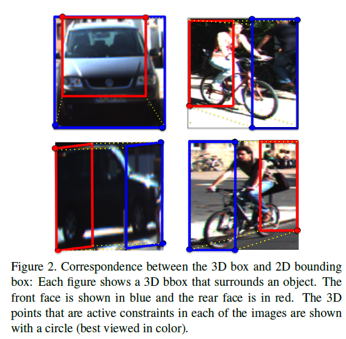

Single View Metrology 和3D bbox estiomation using deep learning and geometry 论文阅读笔记

<!--more-->

## 3D bbox estimation using deep learning and geometry

通过神经网络输出三维物体朝向(3D object orientation)，三维物体尺寸(3d object dimensions)，结合2Dbbox 的几何约束，使能够恢复一个稳定的3D物体姿态（$R,T$），通过Kitti数据集上的三维物体尺寸信息和三维物体bbox进行评估。
kitti数据集只评估3Dbbox的方向(orientation estimate)；此方法另外引入了3个额外的度量信息评估3d Box的准确性

- distance to center of box
- distance to the center of the closest bounding box face
- the overall bounding box overlap with the ground truth box（3D IOU）

## 3D Bounding box estimation

前提:一个3D bbox 的投影应该包裹2D bbox，并同时假设2D detector 训练得到的bbox 是与3d bbox 投影有关的。

**2D bbox 每一边至少匹配3D bbox的一个角** 即2D bbox 需要包裹住 3D bbox

3D box的描述为:

- 中心位置   $T=[t_x,t_y,t_z]^T$,  (center of translation)
- 尺寸         $D=[d_x,d_y.d_z]$  （dimension）
- 方向        $R(\theta,\phi,\alpha)$,              (orientation) 采用方向角、仰角、翻滚角 

### 3D bbox的投影与2D bbox之间的约束关系

在相机坐标系下确定位姿$(R,T)\in SE(3)$ ,相机内参矩阵$K$ ,则一个物体坐标系下的三维坐标点$X_o=[X,Y,Z,1]^T$投影到图像中的坐标$x=[x,y,1]$的转换关系：
$$
x=K[R\ \ \ \ T]X_o
$$
假设原始的物体坐标系的原点位于3D bbox 的中心，并且物体尺寸已知，则3D bbox顶点的坐标可以描述为：
$$
X_1 = [d_x/2,d_y/2,d_z/2]^T,X_2 = [-d_x/2,d_y/2,d_z/2]^T,...,X_8=[-d_x/2,-d_y/2,-d_z/2]
$$
约束条件是2D bbox($x_{min},y_{min},x_{max},y_{max}$)的每一顶点至少被一个3D bbox 角点的投影得到，例如：
考虑3d bbox 顶点 $X_0=[d_x/2,-d_y/2,d_z/2]$ 投影到2d bbox左边 坐标$x_{min}$,这用点对边的约束表示为下列等式。

其中$(.)_x$表示透视投影的x坐标，同样的方式可以推导出2d bbox的参数($x_{min},y_{min},x_{max},y_{max}$),总体来说，2D bbox的顶点为3d bbox提供了四个约束，但是这不足以限制3d bbox的九自由度（three for translation, three for rotation, and three for box dimensions），需要bbox的几何特性以及视觉外观进一步约束3d box。

### 如何选择回归参数

- 方向角$R(\theta,\phi,\alpha)$

- 物体尺寸 $D=[d_x,d_y.d_z]$

  估计物体尺寸而不估计位置的原因是物体尺寸的方差较小(车辆的尺寸基本一致)，同时不会因为旋转而发生变化(因为我们同时也在回归方向角)，物体尺寸的估计更容易与得到的物体类别紧密联系。

通过回归得到的物体尺寸、3D bbox 方向、2D bbox 可以求得 物体位置，

仅考虑一般情况，3D bbox的8个顶点可以投影到任意的2D bbox的4个边，总共就有$8^4=4096$中情况，但在大多数场景下，可以假定目标是竖直的，因此，2D bbox的顶部和底部只对应于3D bbox的顶部和底部(1024中情况)，同时目标不发生翻滚时(roll=0)，则垂直边的2D bbox 坐标$x_{min},x_{max}$只能与3D bbox中的垂直边相关联，kitti中默认(roll = 0 ,pitch =0)，因此，最终投影关系的匹配数量只有64种情况,下图给出了一些匹配的情况，正面为蓝色，背面为红色框。

### Orientation Estimation

上图右面的全局图像中，汽车的行驶方向并没有改变，但是在左边截取的图像中 显然汽车的方向发生了变化。因此在相机参考系下通过检测窗口获取物体的方向是不可行的，因为其余在图像中的位置相关。

上图所示，全局方向为$\theta$ (3d bbox方向)，局部方向$\theta_{l}$为相机中心与检测框中心(假设为目标中心)的射线确定。由于$\theta_l$会随着检测框中图像的不同而变化，因此训练的参数为$\theta_l$ 。通过给定相机内参$\theta_{ray}$的计算是很容易的，通过计算的到的$\theta_{ray}$以及估计得到的局部方向$\theta_{l}$很容易就可以得到全局方向$\theta=\theta_l+\theta_{ray}-2\pi$。

### 网络结构

在方向估计时

在尺寸估计时，由于同一类别的物体方差很小，因此估计的是相对于标准(平均)尺寸（通过训练集上的尺寸可以计算得到）的差值。

